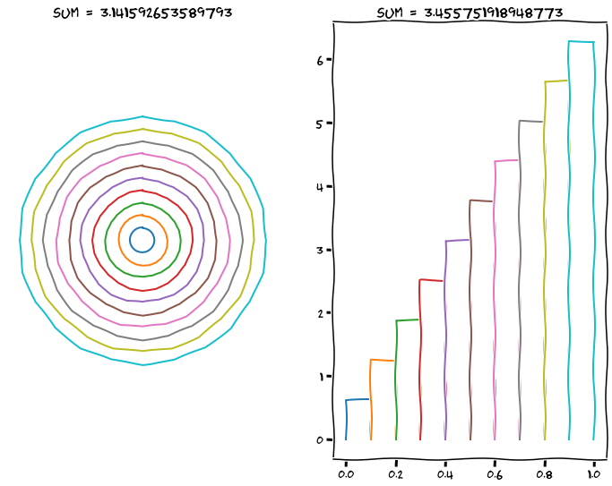

---
redirect_from:
  - "/calculus/section1-whycalc"
interact_link: content/Calculus/section1_whycalc.ipynb
kernel_name: python3
has_widgets: false
title: 'Why calculus?'
prev_page:
  url: /Vectors/section17_furtherProblems.html
  title: 'Further problems'
next_page:
  url: 
  title: ''
comment: "***PROGRAMMATICALLY GENERATED, DO NOT EDIT. SEE ORIGINAL FILES IN /content***"
---


## Why calculus?
---

Calculus is a way of solving complicated problems: _"Divide the problem into little parts (differentiation), solve problem for each little part, which is easier, then assemble the parts to solve the complex problem (integration)."_

We start the discussionn with _differential_ calculus, followed by _integral_ calculus. But before we do this, let us give an example of how the strategy of dividing and assembling can solve a problem.


### Example
---

We know that the circumference of a circle of radius $r$ is $2\pi r$. Use this information to infer the area of a circle of radius $r$. _Hint: divide the circle into smaller and smaller segments, which you arrange in a clever way._ 


It was Archimedes who determined the area of a circle using this method.


In an another approach we divide the circle into concentric rings, which we straighten and arrange the resulting "rectangles" along the $x$-axis.  


<div markdown="1" class="cell code_cell">
<div class="input_area hidecode" markdown="1">
```python
from ipywidgets import interactive, IntSlider
from IPython.display import display
import matplotlib.pyplot as plt
import numpy as np

plt.xkcd()  # Yes...
plt.rcParams["figure.figsize"] = (12, 9)

al_range = np.linspace(0,2*np.pi,num=25)
R = 1
 
def plotRings(n=5):    
    fig, (ax0,ax1) = plt.subplots(1, 2)
    ax0.axis('equal')
    ax0.axis('off')
    
    r_range, dr = np.linspace(0,R,n+1,retstep=True)
    
    for r in r_range[1:]:
        ax0.plot((r)*np.sin(al_range),(r)*np.cos(al_range))
 
    S=0
    for r in r_range[:-1]:
        ax1.plot([r,r,r+dr,r+dr],[2*(0)*np.pi, 2*(r+dr)*np.pi, 2*(r+dr)*np.pi, 2*(0)*np.pi])
        S = S + dr*2*(r+dr)*np.pi
    
    s = str(S)
    ax1.set_title(f'Sum = {s}')
    ax0.set_title(f'Sum = {np.pi}')
    
    #plt.show()
    
#widget = interactive(plotRings, n=IntSlider(min=2, max=60, step=1, continuous_update=False))
#display(widget)

plotRings(n=10)

```
</div>

<div class="output_wrapper" markdown="1">
<div class="output_subarea" markdown="1">

{:.output_png}


</div>
</div>
</div>


---

### Example

Johann Kepler (1571 - 1630) studied the motion of our planets. He found that each planet moves along an ellipse around the sun, but with varying speed - the closer to the sun, the higher was the speed of the planet. But according to what rule did the speed change? Kepler found that a planet moves such that it covers _an equal area_ any given time interval. 


In order to find this law, he had to determine the area bounded by _curved lines_. Using a similar method as above, he divided the shaded region in small sections (which he approximated with triangles) and summed the triangle areas to find the total area.


<div markdown="1" class="cell code_cell">
<div class="input_area" markdown="1">
```python
#needs to be in the last cell for css styling
from IPython.core.display import HTML
def css_styling():
    styles = open("../assets/custom/custom.css", "r").read()
    return HTML(styles)
css_styling()

```
</div>

</div>


