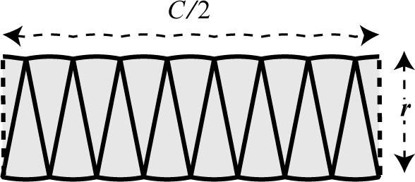

---
redirect_from:
  - "/calculus/section1-whycalc"
interact_link: content/Calculus/section1_whycalc.ipynb
kernel_name: python3
has_widgets: false
title: 'Differential calculus'
prev_page:
  url: /Vectors/section17_furtherProblems.html
  title: 'Further problems'
next_page:
  url: /Calculus/section1_whycalc.html
  title: 'Change'
comment: "***PROGRAMMATICALLY GENERATED, DO NOT EDIT. SEE ORIGINAL FILES IN /content***"
---


## Why calculus?
---

Calculus is a way of solving complicated problems: _"Divide the problem into little parts (differentiation), solve problem for each little part, which is easier, then assemble the parts to solve the complex problem (integration)."_

We start the discussionn with _differential_ calculus, followed by _integral_ calculus. But before we do this, let us give an example of how the strategy of dividing and assembling can solve a problem.


### Example
---

We know that the circumference of a circle of radius $r$ is $2\pi r$. Use this information to infer the area of a circle of radius $r$. _Hint: divide the circle into smaller and smaller segments, which you arrange in a clever way._ 



It was Archimedes who determined the area of a circle using this method.

---

### Example

Johann Kepler (1571 - 1630) studied the motion of our planets. He found that each planet moves along an ellipse around the sun, but with varying speed - the closer to the sun, the higher was the speed of the planet. But according to what rule did the speed change? Kepler found that a planet moves such that it covers _an equal area_ any given time interval. 


In order to find this law, he had to determine the area bounded by _curved lines_. Using a similar method as above, he divided the shaded region in small sections (which he approximated with triangles) and summed the triangle areas to find the total area.


<div markdown="1" class="cell code_cell">
<div class="input_area" markdown="1">
```python
%pylab inline

plt.xkcd()  # Yes...
plt.plot(sin(linspace(0, 10)))
plt.title('Whoo Hoo!!!')

```
</div>

<div class="output_wrapper" markdown="1">
<div class="output_subarea" markdown="1">
{:.output_stream}
```
Populating the interactive namespace from numpy and matplotlib
```
</div>
</div>
<div class="output_wrapper" markdown="1">
<div class="output_subarea" markdown="1">


{:.output_data_text}
```
Text(0.5, 1.0, 'Whoo Hoo!!!')
```


</div>
</div>
<div class="output_wrapper" markdown="1">
<div class="output_subarea" markdown="1">

{:.output_png}


</div>
</div>
</div>


<div markdown="1" class="cell code_cell">
<div class="input_area" markdown="1">
```python
%matplotlib notebook

from ipywidgets import interact, interact_manual
import ipywidgets as widgets

@widgets.interact
def f(x=5):
    print(x)

```
</div>

<div class="output_wrapper" markdown="1">
<div class="output_subarea" markdown="1">
{:.output_data_text}
```
interactive(children=(IntSlider(value=5, description='x', max=15, min=-5), Output()), _dom_classes=('widget-in…
```

</div>
</div>
</div>

