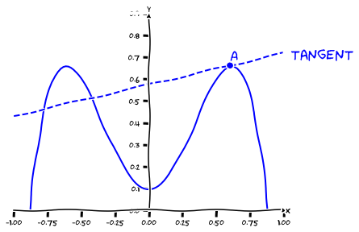

---
redirect_from:
  - "/calculus/section2-tangents"
interact_link: content/Calculus/section2_tangents.ipynb
kernel_name: python3
has_widgets: false
title: 'Tangents'
prev_page:
  url: /Calculus/section1_whycalc.html
  title: 'Differential calculus'
next_page:
  url: 
  title: ''
comment: "***PROGRAMMATICALLY GENERATED, DO NOT EDIT. SEE ORIGINAL FILES IN /content***"
---


<div markdown="1" class="cell code_cell">
<div class="input_area hidecode" markdown="1">
```python
from ipywidgets import interactive, IntSlider, FloatSlider
from IPython.display import display
import matplotlib.pyplot as plt
import numpy as np
import bitlib as bit

plt.xkcd()  # Yes...
plt.show()

```
</div>

</div>


## Tangents
---
Consider a smooth curve and a point $A$ on this curve. The __tangent__ to this curve at point $A$ is the straight line that _touches but does not cross_ the curve at $A$. But note that the tangent at $A$ is allowed to cross the curve anywhere else. As we will see later, many interesting problems can be reduced to finding the slope of some tangent to some curve.


<div markdown="1" class="cell code_cell">
<div class="input_area hidecode" markdown="1">
```python
plt.rcParams["figure.figsize"] = (6, 4.5)
fig, ax = plt.subplots(1, 1) #ax is 2x2 matrix

def pow(x):
    return -4*np.power(x,4)+3*np.power(x,2)+0.1

def powPrime(x):
    return -16*np.power(x,3)+6*np.power(x,1)


def g(ax):
    #plot graph
    x = np.linspace(-1,1, num = 100)
    ax.plot(x, pow(x), 'blue')
    ax.set_ylim((0,0.9))
    ax.set_xlim((-1,1)) 
    bit.formatAxes(ax)
    bit.formatAxes(ax)
    #plot tangent
    al = powPrime(0.6)
    b = pow(0.6)-al*0.6
    x = np.linspace(-1,1, num = 2)
    ax.plot(x,al*x+b,'b', linestyle="--")
    
    ax.plot(0.6,pow(0.6), 'bo')
    ax.text(0.6,1.05*pow(0.6),'A', color='blue', size = 18)
    ax.text(1.05,1.05*pow(0.6),'tangent', color='blue', size = 18)
    
g(ax)

```
</div>

<div class="output_wrapper" markdown="1">
<div class="output_subarea" markdown="1">

{:.output_png}


</div>
</div>
</div>


Note that the equation of a tangent (a straight line) is a linear function $t(x)=ax+b$, where $a$ is the slope of the tangent and $b$ is its $y$-intercept.


### Exercise
---
Consider the unit circle (that is, a circle with radius $1$). Point $A$ is on this circle at angle $30^\circ$. Determine the equation of the tangent to the circle at $A$. 

Hint: use the fact that the angle between $R$ and the tangent at $A$ is $90^\circ$, and  use _SOHCAHTOA_ .


<div markdown="1" class="cell code_cell">
<div class="input_area hidecode" markdown="1">
```python
plt.rcParams["figure.figsize"] = (8, 6)

al_range = np.linspace(0,2*np.pi,num=100)
R = 1
  
fig, (ax0) = plt.subplots(1, 1)
ax0.axis('equal')
ax0.axis('off')

#plot circle
ax0.plot([-1.1,1.1],[0,0],'black', linestyle="-", linewidth=0.5)
ax0.plot([0,0],[-1.1,1.1],'black', linestyle="-", linewidth=0.5)
ax0.plot(R*np.sin(al_range),R*np.cos(al_range),'black')

#plot tangent
al = -1.732
b = 2
x = np.linspace(0,1.8, num = 2)
ax0.plot(x,al*x+b,'b', linestyle="--")

#plot A
ax0.text(0.9,0.6,'A', color='blue', size = 18)
ax0.plot([0,0.86],[0,0.5],'blue', linestyle="-", linewidth=0.5)
ax0.text(0.5,0.3,'r', color='blue')
ax0.plot(0.866,0.5,'ob')
ax0.text(0.2,0.05,'$30^\circ$', color='blue')

plt.show()

```
</div>

<div class="output_wrapper" markdown="1">
<div class="output_subarea" markdown="1">

{:.output_png}


</div>
</div>
</div>


### Solution
---
The equation of the tangent has the general form $t(x)=ax+b$, where $a$ is the slope of the tangent, and $b$ is its $y$-intercept. We have 

$$\nonumber a=\frac{\Delta y}{\Delta x}=\frac{O}{-A}=\tan(60^\circ)=-1.7320...$$
   
To find $b$, note that because of $H=1$ it is $\sin(30^\circ)=\frac{O}{H}=O$ and $\cos(30^\circ)=\frac{A}{H}=A$. It follows that the $x$ and $y$ coordinate of point $A$ is $x=O=\sin(30^\circ)=0.8660...$ and $y=O=\cos(30^\circ)=0.5$, thus $A(0.8660...\vert 0.5)$. Because the point $A$ is on the tangent, it is
  
$$\nonumber f(0.8660...)=0.5 \rightarrow  -1.7320...\cdot 0.8660...+b = 0.5 \rightarrow b=2$$
  
Thus, we have $t(x)=-1.7320... \cdot x +2$.
  


