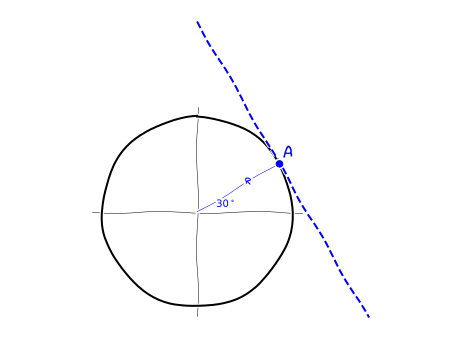

---
redirect_from:
  - "/calculus/section2-tangents"
interact_link: content/Calculus/section2_tangents.ipynb
kernel_name: python3
has_widgets: false
title: 'Tangents'
prev_page:
  url: /Calculus/section1_whycalc.html
  title: 'Differential calculus'
next_page:
  url: 
  title: ''
comment: "***PROGRAMMATICALLY GENERATED, DO NOT EDIT. SEE ORIGINAL FILES IN /content***"
---


<div markdown="1" class="cell code_cell">
<div class="input_area hidecode" markdown="1">
```python
from ipywidgets import interactive, IntSlider, FloatSlider
from IPython.display import display
import matplotlib.pyplot as plt
import numpy as np
import bitlib as bit

plt.xkcd()  # Yes...

```
</div>

</div>


## Tangents

Consider a smooth curve and a point $A$ on this curve. The __tangent__ to this curve at point $A$ is the straight line that _touches but does not cross_ the curve at $A$. But note that the tangent at $A$ is allowed to cross the curve anywhere else. As we will see later, many problems in differential calculus reduces to finding the slope of a tangent.


<div markdown="1" class="cell code_cell">
<div class="input_area hidecode" markdown="1">
```python
plt.rcParams["figure.figsize"] = (6, 4.5)
fig, ax = plt.subplots(1, 1) #ax is 2x2 matrix

def pow(x):
    return -4*np.power(x,4)+3*np.power(x,2)+0.1

def powPrime(x):
    return -16*np.power(x,3)+6*np.power(x,1)


def g(ax):
    #plot graph
    x = np.linspace(-1,1, num = 100)
    ax.plot(x, pow(x), 'blue')
    ax.set_ylim((0,0.9))
    ax.set_xlim((-1,1)) 
    bit.formatAxes(ax)
    bit.formatAxes(ax)
    #plot tangent
    al = powPrime(0.6)
    b = pow(0.6)-al*0.6
    x = np.linspace(-1,1, num = 2)
    ax.plot(x,al*x+b,'b', linestyle="--")
    
    ax.plot(0.6,pow(0.6), 'bo')
    ax.text(0.6,1.05*pow(0.6),'A', color='blue', size = 18)
    
g(ax)

```
</div>

<div class="output_wrapper" markdown="1">
<div class="output_subarea" markdown="1">

{:.output_png}


</div>
</div>
</div>


Note that the equation of a tangent is a linear function $t(x)=ax+b$, where $a$ is the slope of the tangent (a straight line) and $b$ is its $y$-intercept.

### Exercise
---
1. Consider the unit circle. Point $A$ is on this circle at radius $30^\circ$. Determine the equation of the tangent to the circle at $A$.

2. Consider the graph of the function $f(x)=\sqrt{x}$. Point $A(2\vert \sqrt{2})$ is on the graph. Determine, as _precise as possible_, the slope of the tangent to the graph at $A$.


### Solution
---
1. The equation of the tangent has the general form $t(x)=ax+b$, where $a$ is the slope of the tangent, and $b$ is its $y$-intercept. We have 

   $$a=\frac{\Delta y}{\Delta x}=\frac{O}{-A}=\tan(60^\circ)=-1.7320...$$
   
   To find $b$, note that because of $H=1$ it is $\sin(30^\circ)=\frac{O}{H}=O$ and $\cos(30^\circ)=\frac{A}{H}=A$. It follows that the $x$ and $y$ coordinate of point $A$ is $x=O=\sin(30^\circ)=0.8660...$ and $y=O=\cos(30^\circ)=0.5$, thus $A(0.8660...\vert 0.5)$. Because the point $A$ is on the tangent, it is
  
   $$f(0.8660...)=0.5 \rightarrow  -1.7320...\cdot 0.8660...+b = 0.5 \rightarrow b=2$$
  
   Thus, we have $t(x)=-1.7320... \cdot x +2$.
  
2. You can give a an estimate of the slope of the tangent by determining the slope of the straight line that passes through the points $A$ and $B$ on the graph (a so called _secant_ of the graph). The closer $B$ is to $A$, the more parallel are the secant and the tangent, and the better is the estimate of the slope of the tangent. But note that with this method it is quite difficult to find the precise slope of the tangent. All we can do is finding better and better approximations, but these are still approximations.


<div markdown="1" class="cell code_cell">
<div class="input_area hidecode" markdown="1">
```python
plt.rcParams["figure.figsize"] = (12, 9)
fig, ax = plt.subplots(2, 2) #ax is 2x2 matrix

def f(x2, ax):
    x1=2
    A=[x1,np.sqrt(x1)]
    B=[x2,np.sqrt(x2)]
    
    al_sec = (B[1]-A[1])/(B[0]-A[0])
    b_sec = A[1]-al_sec*A[0]
    al_tan = 0.5*1/np.sqrt(x1)
    b_tan = A[1]-al_tan*A[0]
                                 
    x_f = np.linspace(0,4, num=100)
    x_sec = np.linspace(0,4, num=2)
    x_tan = np.linspace(0,4, num=2)

    ax.axis('equal')
    ax.set_ylim((0,3))
    ax.set_xlim((0,4)) 
    bit.formatAxes(ax)
    
    #plot root function
    ax.plot(x_f,np.sqrt(x_f),'blue', linewidth=5)
    
    #plot tangent
    ax.plot(x_tan,al_tan*x_tan+b_tan,'blue', linestyle="--")
    
    #plot secant          
    ax.plot(x_sec,al_sec*x_sec+b_sec,'red')
    
    
    #plot points
    ax.plot(A[0],A[1],'bo')
    ax.plot(B[0],B[1],'ro')

    ax.text(A[0],0.85*A[1],'A', color='blue', size=18)
    ax.text(B[0]+0.1,0.85*B[1],'B',  color='red', size=18)

    ax.text(0.1,2.6,f'slope secant   = {str(round(al_sec,8))}', color='red', size = 18)
    ax.text(0.1,2.8,f'slope tangent = {str(round(al_tan,8))}', color='blue', size = 18)
    

#widget = interactive(f, x2=FloatSlider(min=0, max=1.99, step=0.05, continuous_update=False))
#display(widget)
f(0.1,ax[0,0])
f(0.5,ax[0,1])
f(1.0,ax[1,0])
f(1.5,ax[1,1])


```
</div>

<div class="output_wrapper" markdown="1">
<div class="output_subarea" markdown="1">

{:.output_png}


</div>
</div>
</div>


<div markdown="1" class="cell code_cell">
<div class="input_area hidecode" markdown="1">
```python
#needs to be in the last cell for css styling
from IPython.core.display import HTML
def css_styling():
    styles = open("../assets/custom/custom.css", "r").read()
    return HTML(styles)
css_styling()

```
</div>

<div class="output_wrapper" markdown="1">
<div class="output_subarea" markdown="1">


<div markdown="0" class="output output_html">
<style>

    div.cell {
        width:800px;
        margin-left:16% !important;
        margin-right:auto;
    }
    h1 {
        font-family: "Times New Roman" !important;
    }
    h2 {
        font-family: "Times New Roman" !important;
	      color: green
    }
    h3 {
      font-family: "Times New Roman" !important;
        color: gray
    }
    h4 {
      font-family:  "Times New Roman" !important;
        margin-top:12px;
        margin-bottom: 3px;
    }
    div.text_cell_render {
        font-family: "Times New Roman" !important;
        line-height: 145%;
        font-size: 18px;
        width:800px;
        margin-left:auto;
        margin-right:auto;
    }
    .CodeMirror {
            font-family: "Source Code Pro", source-code-pro,Consolas, monospace;
    }
    .prompt {
        display: None;
    }
    .text_cell_render h5 {
        font-weight: 300;
        /* font-size: 22pt; */
        color: #4057A1;
        font-style: italic;
        margin-bottom: .5em;
        margin-top: 0.5em;
        display: block;
    }

    .warning{
        color: rgb( 240, 20, 20 )
        }

    /* .MathJax {
        font-size: 1em;
    } */

    div.important {
       background-color: #fcf2f2;
       border-color: #dFb5b4;
       border-left: 5px solid #dfb5b4;
       padding: 0.5em;
    }

    /* div.exc {
       background-color: lightgray;
       border-color: lightgray;
       border-left: 5px solid gray;
       padding: 0.5em;
    }

    div.sol {
       background-color: lightgray;
       border-color: lightgray;
       border-left: 5px solid gray;
       padding: 0.5em;
    } */

    li{
       margin: 10px 0;
    }

    ol ol { list-style-type: upper-alpha; important! }
    ol ol ol { list-style-type: lower-alpha; important! }

</style>


<script type="text/x-mathjax-config">
    jax: ["input/TeX","output/HTML-CSS"],
    MathJax.Hub.Config({
                TeX: {
                        extensions: ["AMSmath.js"],
			                  Macros: {
      				                RR: '{\\bf TOM}',
      				                bold: ['\\boldsymbol{#1}',1],
    			              },
                },
		            tex2jax: {
            		    inlineMath: [ ["$","$"], ["\\(","\\)"] ],
                    displayMath: [ ["$$","$$"], ["\\[","\\]"] ],
            		    processEscapes: true,
            		    processEnvironments: true,
        	     },
               MatchWebFonts: {
                 fontCheckDelay: 5 * 1000,
                 fontCheckTimeout: 30 * 1000,
               }
               "HTML-CSS": {
                    /* scale: 130 */
                    styles: {'.MathJax_Display': {"margin": 0}},
                    availableFonts: ["STIX-Web","TeX","Latin-Modern"],
                    preferredFont: "STIX-Web",
                    webFont: "STIX-Web",
                    matchFontHeight: true,
                    /* minScaleAdjust: 55, */
                },
        });
</script>

</div>


</div>
</div>
</div>

