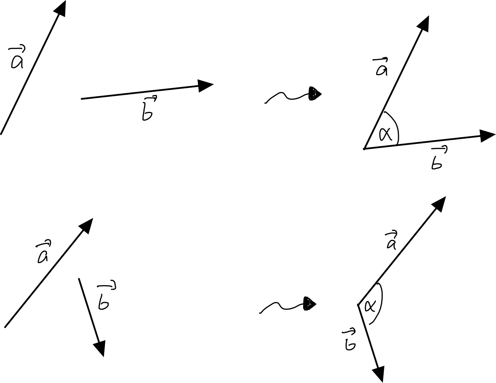
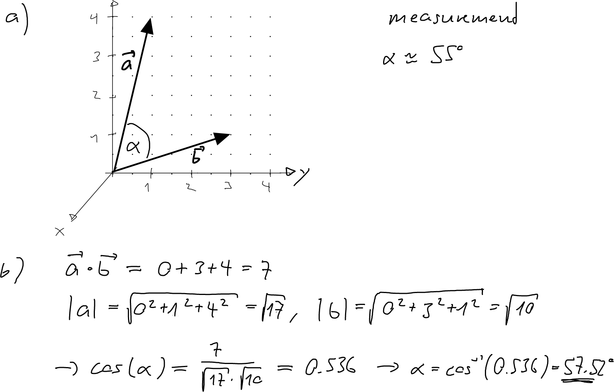

---
redirect_from:
  - "/vectors/section10-angles"
interact_link: content/Vectors/section10_angles.ipynb
kernel_name: python3
has_widgets: false
title: 'The intersection of straight lines'
prev_page:
  url: /Vectors/section9_scalarproduct.html
  title: 'The intersection of straight lines'
next_page:
  url: /Vectors/section11_proofOfangleformula.html
  title: 'The intersection of straight lines'
comment: "***PROGRAMMATICALLY GENERATED, DO NOT EDIT. SEE ORIGINAL FILES IN /content***"
---

## Scalar product and angles
---

Consider two (non-zero) vectors $\vec{a}$ and $\vec{b}$ and represent them in space as arrows with overlapping tails.

We want to find the (smaller) angle $\alpha$ that is formed between the two arrows (which will always be between $0^\circ$ and $180^\circ$). It turns out that the angle is closely related to the scalar product between $\vec a$ and $\vec b$:

$$\nonumber\boxed{\cos(\alpha)=\frac{\vec{a}\bullet \vec{b}}{|\vec{a}|\cdot |\vec{b}|} }$$

Once we have calculated the value for $\cos(\alpha)$, we can calculate $\alpha$ using $\cos^{-1}$.

### Example
---
Consider the vectors $\vec{a} = \left(\begin{array}{r} 3\\\ 5\\\ 2 \end{array}\right)$ and $\vec{b}=\left(\begin{array}{r} -1\\\ 3\\\ 8 \end{array}\right)$. It is

$$\nonumber\cos(\alpha)=\frac{\vec{a}\bullet \vec{b}}{|\vec{a}|\cdot |\vec{b}|} = \frac{3\cdot (-1)+5\cdot 3+2\cdot 8}{\sqrt{3^2+5^2+2^2}\cdot \sqrt{(-1)^2+3^2+8^2}} = \frac{28}{\sqrt{38}\cdot \sqrt{74}} = 0.528$$

Thus, the smaller angle between $\vec a$ and $\vec b$ is $\alpha = \cos^{-1}(0.528)=58.12^\circ$

## Exercise
---

Consider the vectors $\vec{a}=\left(\begin{array}{r} 0\\\ 1\\\ 4 \end{array}\right)$ and $\vec{b}=\left(\begin{array}{r} 0\\\ 3\\\ 1 \end{array}\right)$.
	
1. Draw the arrows and measure the angle between the two arrows.
2. Calculate the angle and compare with the measurement.

## Solution
---

