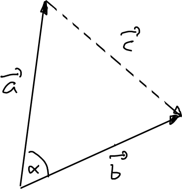

---
redirect_from:
  - "/vectors/section11-proofofangleformula"
interact_link: content/Vectors/section11_proofOfangleformula.ipynb
kernel_name: python3
has_widgets: false
title: 'Proof of the angle formula'
prev_page:
  url: /Vectors/section10_angles.html
  title: 'Scalar product and angles'
next_page:
  url: /Vectors/section12_orthogonalVectors.html
  title: 'Orthogonal vectors'
comment: "***PROGRAMMATICALLY GENERATED, DO NOT EDIT. SEE ORIGINAL FILES IN /content***"
---

## The proof of the angle formula
---

We prove the formula 

$$\nonumber\boxed{\cos(\alpha)=\frac{\vec{a}\bullet \vec{b}}{\vert\vec{a}\vert\cdot \vert\vec{b}\vert} }$$

where $\vec{a}=\left(\begin{array}{r} a_x\\\ a_y\\\ a_z \end{array}\right)$ and $\vec{b}=\left(\begin{array}{r} b_x\\\ b_y\\\ b_z \end{array}\right)$. It is a simple application of the cosine-law.

- Find the vector $\vec{c}$ that runs from the tip of vector $\vec{a}$ to the tip of vector $\vec{b}$.  

  

  As $\vec{a}+\vec{c}=\vec{b}$ (completing the triangle), it follows that 

  $$\nonumber\vec{c}=\vec{b}-\vec{a}=\left(\begin{array}{r} b_x-a_x\\ b_y-a_y\\ b_z-a_z \end{array}\right)$$ 

- Consider the triangle that is given by the vectors $\vec{a}$, $\vec{b}$, and $\vec{c}$. What are the side lengths of this triangle? 

  $$\nonumber a=\vert\vec{a}\vert=\sqrt{a_x^2+a_y^2+a_z^2}$$ 

  $$\nonumber b=\vert\vec{b}\vert=\sqrt{b_x^2+b_y^2+b_z^2}$$ 

  $$\nonumber c=\vert\vec{c}\vert=\sqrt{(b_x-a_x)^2+(b_y-a_y)^2+(b_z-a_z)^2}$$ 

  Recall the cosine-law, which states that for a triangle with side lengths $a$, $b$, and $c$ it is 
  
  $$\nonumber c^2=b^2+a^2-2\cdot a\cdot b \cdot \cos(\alpha)$$ 
  
  where $\alpha$ is the angle between the sides $a$ and $b$ (follows from SOHCAHTOA). Applying this law to our triangle, we get

  $$\nonumber \vert\vec{c}\vert^2=\vert\vec{a}\vert^2+\vert\vec{b}\vert^2-2\cdot \vert\vec{a}\vert\cdot \vert\vec{b}\vert \cdot \cos(\alpha)$$ 

  By bringing $\cos(\alpha)$ on the left side, and everything else on the right side of the equal sign, we get 

  $$\nonumber \cos(\alpha)=\frac{\vert\vec{a}\vert^2+\vert\vec{b}\vert^2-\vert\vec{c}\vert^2}{2\cdot \vert\vec{a}\vert \cdot \vert\vec{b}\vert}$$ 

- Plug in the components, and simplify as much as possible:

  $$\nonumber\begin{array}{rl}
  \cos(\alpha) & =& \frac{a_x^2+a_y^2+a_z^2+b_x^2+b_y^2+b_z^2 - ((b_x-a_x)^2+(b_y-a_y)^2+(b_z-a_z)^2)}{2\cdot \sqrt{a_x^2+a_y^2+a_z^2}\cdot \sqrt{b_x^2+b_y^2+b_z^2}} \\\
  & = & \frac{a_x^2+a_y^2+a_z^2+b_x^2+b_y^2+b_z^2 - b_x^2+2a_x b_x - a_x^2  - b_y^2+2a_y b_y - a_y^2 - b_z^2+2a_z b_z - a_z^2}{2\cdot \sqrt{a_x^2+a_y^2+a_z^2}\cdot \sqrt{b_x^2+b_y^2+b_z^2}} \\\
  & = & \frac{2a_xb_x+2a_yb_y+2a_zb_z}{2\cdot \sqrt{a_x^2+a_y^2+a_z^2}\cdot \sqrt{b_x^2+b_y^2+b_z^2}} \\\
  & = & \frac{a_xb_x+a_yb_y+a_zb_z}{\sqrt{a_x^2+a_y^2+a_z^2}\cdot \sqrt{b_x^2+b_y^2+b_z^2}} = \frac{\vec{a}\bullet \vec{b}}{\vert\vec{a}\vert\cdot \vert\vec{b}\vert} 
  \end{array}$$

And we are done!

