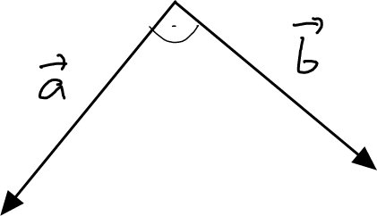
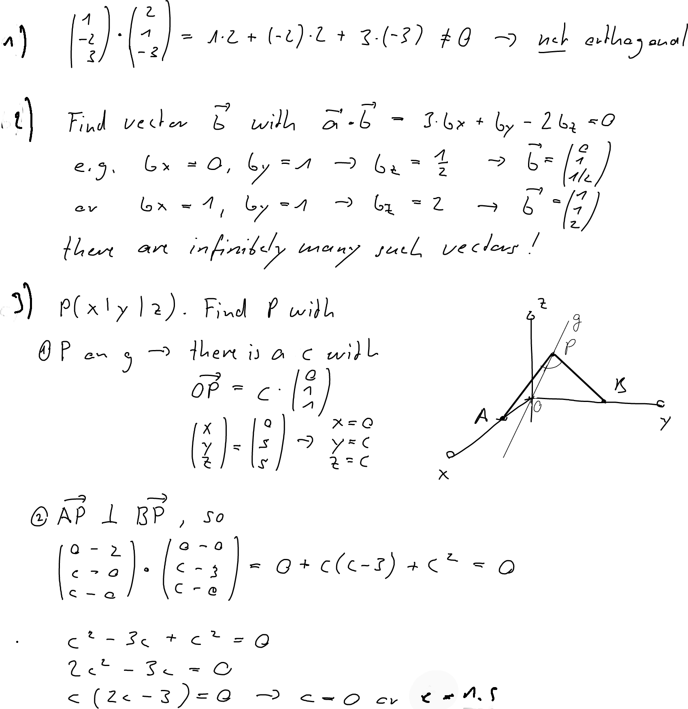

---
redirect_from:
  - "/vectors/section12-orthogonalvectors"
interact_link: content/Vectors/section12_orthogonalVectors.ipynb
kernel_name: python3
has_widgets: false
title: 'Orthogonal vectors'
prev_page:
  url: /Vectors/section11_proofOfangleformula.html
  title: 'Proof of the angle formula'
next_page:
  url: /Vectors/section13_planes.html
  title: 'The plane'
comment: "***PROGRAMMATICALLY GENERATED, DO NOT EDIT. SEE ORIGINAL FILES IN /content***"
---

## Orthogonal vectors
---

Two (non-zero) vectors $\vec{a}$ and $\vec{b}$ are called __orthogonal__ (or __perpendicular__), written 

$$\nonumber\vec{a} \perp \vec{b}$$ 

if the angle between the vectors is a right angle (that is, $\alpha = 90^\circ$.

Recall that $\cos(\alpha)=0$ if, and only if $\alpha=90^\circ, 270^\circ, ...$, so if, and only if the angle is a right angle. And because of the angle formula

$$\cos(\alpha)=\frac{\vec{a}\bullet \vec{b}}{\vert\vec{a}\vert\cdot \vert\vec{b}\vert}$$ 

the following important theorem follows:

$$\nonumber\boxed{\vec{a} \perp \vec{b}\mbox{ if, and only if, } \vec{a}\bullet \vec{b}=0}$$

### Example
---

The vectors $\left(\begin{array}{r} 2\\\ 3\\\ 4 \end{array}\right)$ and $\left(\begin{array}{r} 0\\\ -4\\\ 3 \end{array}\right)$ are orthogonal, because 

$$\nonumber\left(\begin{array}{r} 2\\ 3\\ 4 \end{array}\right) \bullet \left(\begin{array}{r} 0\\ -4\\ 3 \end{array}\right)=2\cdot 0+ 3\cdot(-4)+ 4\cdot 3 =0$$

## Exercise
---

1. Are the vectors $\left(\begin{array}{r} 1\\\ -2\\\ 3 \end{array}\right)$ and $\left(\begin{array}{r} 2\\\ 1\\\ -3 \end{array}\right)$ orthogonal?
2. Find at least one non-zero vector that is orthogonal to $\vec{a}=\left(\begin{array}{r} 3\\\ 1\\\ -2 \end{array}\right)$. How many such vectors exist and what geometrical object is formed by all these vectors if attached to the origin?
3. Consider the points $A(2\vert 0\vert 0)$ and $B(0 \vert 3 \vert 0)$, and the straight line $g$ that passes through the origin and has direction $\vec{v}=\left(\begin{array}{r} 0\\\ 1\\\ 1 \end{array}\right)$. Find all points $P$ on $g$ such that the segments $AP$ and $BP$ form a right angle.

## Solution
---

