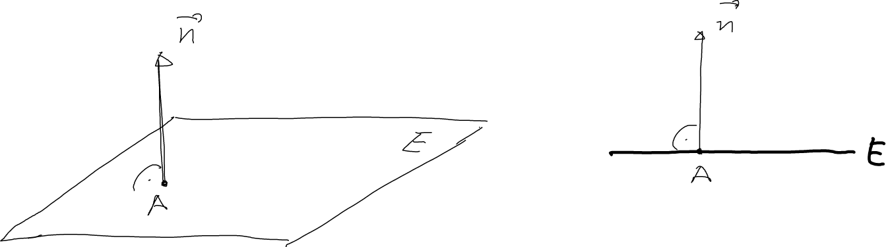
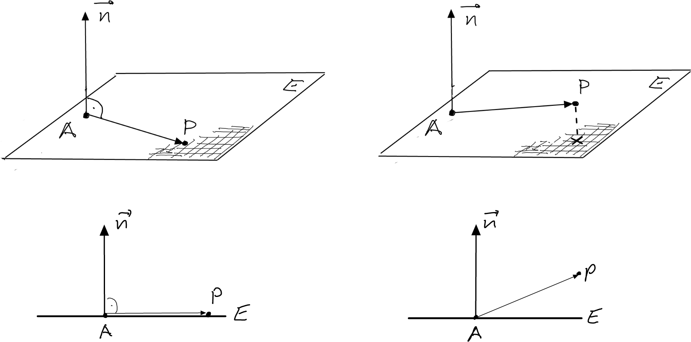

---
redirect_from:
  - "/vectors/section13-planes"
interact_link: content/Vectors/section13_planes.ipynb
kernel_name: python3
has_widgets: false
title: 'The plane'
prev_page:
  url: /Vectors/section12_orthogonalVectors.html
  title: 'Orthogonal vectors'
next_page:
  url: 
  title: ''
comment: "***PROGRAMMATICALLY GENERATED, DO NOT EDIT. SEE ORIGINAL FILES IN /content***"
---

## The plane

The position of a given plane $E$ in space is completely determined by a point $A$ on this plane, and any vector $\vec n$ that forms a right angle with the plane. 

Note:

- Even though we draw borders to indicate a plane, it has no border and extends in all directions to infinity.
- You can think of a plane as a set of infinitely many points. The statement "$A$ is on plane $E$" can therefore be rewritten as $A \in E$.

### Example
---
1. The plane containing point $A(0\vert 0\vert 1)$ and with normal vector $\vec{n}=\left(\begin{array}{r} 0\\\ 0\\\ 1 \end{array}\right)$ is parallel to the $xy$-plane.

2. The plane containing point $A(0\vert 0\vert 1)$ and with normal vector $\vec{n}=\left(\begin{array}{r} 0\\\ 0\\\ -10 \end{array}\right)$ is the same plane as above.

3. The $yz$-plane has the normal vector $\vec{n}=\left(\begin{array}{r} 1\\\ 0\\\ 0 \end{array}\right)$ or $\vec{n}=\left(\begin{array}{r} -0.1\\\ 0\\\ 0 \end{array}\right)$ or $\vec{n}=\left(\begin{array}{r} 140.321\\\ 0\\\ 0 \end{array}\right)$.

---

Consider a plane $E$ containing point $A$ and with normal vector $\vec n$. How can we decide if some other point $P$ in also on the plane? 

From the figure below we see that 
$$\nonumber\boxed{P \in E\,\mbox{ if }\, \overrightarrow{AP} \perp \vec{n}}$$ 

The plane can therefore be written as the following set:

$$\nonumber E = \{\mbox{all points $P$ in space with } \overrightarrow{AP} \perp \vec{n} \}$$

### Example
---

A plane $E$ passes through the point $A(1|0|1)$ and has normal vector $\left(\begin{array}{r} 7\\\ -4\\\ 5 \end{array}\right)$. Is point $P(3\vert1\vert2)$ in $E$? No, because 

$$\nonumber\overrightarrow{AP} \bullet \vec{n} = \left(\begin{array}{r} 3-1\\ 1-0\\ 2-1 \end{array}\right) \bullet \left(\begin{array}{r} 7\\ -4\\ 5 \end{array}\right) = 14-4+5=15\neq 0$$ 

thus $\overrightarrow{AP} \not\perp \vec{n}$.

## Exercise
---

1. Plane $E$ passes through the point $A(1|0|1)$ and has normal vector $\left(\begin{array}{r} 7\\\ -4\\\ 5 \end{array}\right)$. Find another point $Q$ in $E$.

2. A plane $F$ contains the point $A(3|0|0)$ and has normal vector $\vec{n}=\left(\begin{array}{r} 6\\\ 3\\\ 2 \end{array}\right)$. 
	
   1. Are the points $P(1\vert 2\vert 3)$ and $Q(2\vert 4\vert 6)$ in $F$?
   2. Where does $F$ intersect the y-axis?

## Solutions
---

1. In order to find a point $Q(x|y|z)$ on $E$, we have to find $x$, $y$, and $z$ with

   $$\nonumber\overrightarrow{AQ} \perp \vec{n}$$
   
   that is, with 
   
   $$\nonumber\left(\begin{array}{r} x-1\\ y\\ z-1 \end{array}\right) \bullet \left(\begin{array}{r} 7\\\ -4\\\ 5 \end{array}\right) = 0$$
   
   Thus, we obtain the following equation for $x$, $y$, and $z$: 

   $$\nonumber 7(x-1)-4y+5(z-1)=7x-4y+5z-12=0$$ 
   
  There are infinitely many solutions. For example, set $x=1$, $y=0$, so that $7+5z-12=0$ and therefore $z=1$. Thus ${Q(1|0|1)}$ is a point in $E$.

2. 

   1. $P\in F$ because $\overrightarrow{AP} \bullet \vec{n} = \left(\begin{array}{r} 1-3\\\ 2-0\\\ 3-0 \end{array}\right) \bullet \left(\begin{array}{r} 6\\\ 3\\\ 2 \end{array}\right) = -12+6+6=0$. 
   
      $Q \not\in F$ because $\overrightarrow{AQ} \bullet \vec{n} = \left(\begin{array}{r} 2-3\\\ 4-0\\\ 6-0 \end{array}\right) \bullet \left(\begin{array}{r} 6\\\ 3\\\ 2 \end{array}\right)  = -6+12+12=18 \neq 0$.

   2. Let us denote by $S$ the intersection point between $F$ and the y-axis. 
   
      $S$ on the y-axis $\rightarrow S(0\vert y\vert 0)$
      
      $S \in F \rightarrow \overrightarrow{AS} \bullet \vec{n} = \left(\begin{array}{r} 0-3\\\ y-0\\\ 0-0 \end{array}\right)  \bullet \left(\begin{array}{r} 6\\\ 3\\\ 2 \end{array}\right)  = -18+3y+0=0$. 
      
      Thus $y=6$ and therefore $S(0|6|0)$.

