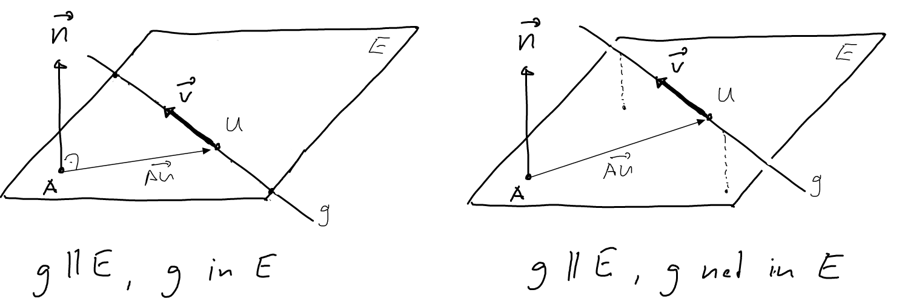
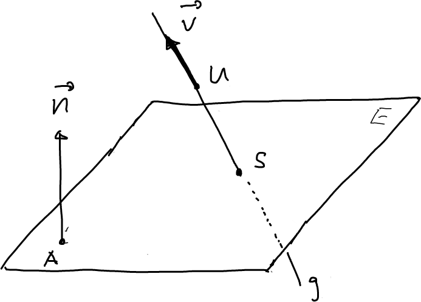

---
redirect_from:
  - "/vectors/section14-intersectionlineplane"
interact_link: content/Vectors/section14_intersectionLinePlane.ipynb
kernel_name: python3
has_widgets: false
title: 'Intersecting straight lines and planes'
prev_page:
  url: /Vectors/section13_planes.html
  title: 'Planes'
next_page:
  url: /Vectors/section15_distanceProblems.html
  title: 'Distance problems'
comment: "***PROGRAMMATICALLY GENERATED, DO NOT EDIT. SEE ORIGINAL FILES IN /content***"
---

## The intersection between a line and a plane
---

Consider a straight line $g$ that passes through the point $U$ and has direction vector $\vec{v}$, and a plane $E$ that contains the point $A$ and has normal vector $\vec{n}$. What is the relationship between $g$ and $E$? There are three possibilities:

1. $g$ is __parallel__ to $E$, in which case it is (see figure)

   $$\nonumber\vec{v} \perp \vec{n}$$
   
   Note how we can distinguish whether $g$ is actually __in__ the plane, or __not in__ the plane. In the first case it is $\overrightarrow{AU} \perp \vec{n}$, and in the second case it is $\overrightarrow{AU} \not\perp \vec{n}$.

   

2. $g$ is not parallel to $E$, in which case there is an intersection point $S$ between $g$ and $E$.

	
	
    To find the intersection point $S$ note that $S\in g$ and $S\in E$:

    $$\nonumber \boxed{\overrightarrow{US} \parallel \vec{v}\, \mbox{ and }\, \overrightarrow{AS} \perp \vec{n} }$$ 

    And these two conditions are sufficient to determine the coordinates of $S$.

### Example 1
---

Plane $E$ contains the point $A(0\vert 0\vert 9)$ and has normal vector $\vec{n}=\left(\begin{array}{r} 1\\\ 4\\\ -3 \end{array}\right)$ Straight line $g$ passes through the point $U(7\vert 2\vert 9)$ and has direction vector $\vec{v}=\left(\begin{array}{r} -2\\\ 3\\\ 4 \end{array}\right)$. Find the intersection point $S$ between $g$ and $E$.

### Solution
---

 - $g$ is not parallel to $E$, as $\nonumber \vec{v}\bullet \vec{n}=-2+12-12=2\neq 0$, so there is a single intersection point $S(x\vert y\vert z)$ 

- $S \in g \rightarrow \overrightarrow{US} \parallel \vec{v} \rightarrow \overrightarrow{US}=c\cdot \vec{v}$. So 

  $$\nonumber \left(\begin{array}{r} x-7\\\ y-2\\\ z-9 \end{array}\right) = \left(\begin{array}{r} -2c\\\ 3c\\\ 4c \end{array}\right) \rightarrow x=-2c+7, y=3c+2, z=4c+9$$

- $S \in E \rightarrow \overrightarrow{AS} \perp \vec{n} \rightarrow \overrightarrow{AS} \bullet \vec{n} = 0$. So

  $$\nonumber \left(\begin{array}{r} x-0\\\ y-0\\\ z-9 \end{array}\right) \bullet \left(\begin{array}{r} 1\\\ 4\\\ -3 \end{array}\right) = 0 \rightarrow x + 4y -3(z-9) = 0$$
  
  Using the fact that $x=-2c+7, y=3c+2$ and $z=4c+9$, and inserting this into the equation above, we get
  
  $$\nonumber  -2c+7+4(3c+2)-3(4c+9-9) = -2c+15=0 \rightarrow c=7.5$$
  
  It follows $x=-2\cdot 7.5+7=-8, y=3\cdot 7.5+2=24.5, z=4\cdot 7.5+9=39 \rightarrow S(-8\vert 24.5\vert 39)$ 
   

### Example 2
---

Plane $E$ contains the point $A(4\vert 4\vert 2)$ and has normal vector $\vec{n}=\left(\begin{array}{r} -2\\\ -2\\\ 3 \end{array}\right)$ Straight line $g$ passes through the point $U(1\vert 2\vert -3)$ and has direction vector $\vec{v}=\left(\begin{array}{r} 1\\\ 1\\\ 2 \end{array}\right)$. Find the intersection point $S$ between $g$ and $E$.

### Solution
---

 - $g$ is not parallel to $E$, as $\vec{v}\bullet \vec{n}=2\neq 0$, so there is a single intersection point $S(x\vert y\vert z)$ 

- $S \in g \rightarrow \overrightarrow{US} \parallel \vec{v} \rightarrow \overrightarrow{US}=c\cdot \vec{v}$. So 

  $$\nonumber \left(\begin{array}{r} x-1\\\ y-2\\\ z+3 \end{array}\right) = \left(\begin{array}{r} c\\\ c\\\ 2c \end{array}\right) \rightarrow x=c+1, y=c+2, z=2c-3$$

- $S \in E \rightarrow \overrightarrow{AS} \perp \vec{n} \rightarrow \overrightarrow{AS} \bullet \vec{n} = 0$. So

  $$\nonumber \left(\begin{array}{r} x-4\\\ y-4\\\ z-2 \end{array}\right) \bullet \left(\begin{array}{r} -2\\\ -2\\\ 3 \end{array}\right) = 0 \rightarrow -2(x-4) -2(y-4)+3(z-2) = 0$$
  
  Inserting the expression for $x, y$, and $z$, we get
  
  $$\nonumber -2(c+1-4)-2(c+2-4)+3(2c-3-2) = 2c-5=0 \rightarrow c=2.5$$
  
  It follows $x=2.5+1=3.5, y=c+2=4.5, z=2\cdot 2.5-3=2 \rightarrow S(3.5\vert 4.5 \vert 2)$ 

## Exercise
---

Plane $E$ contains the point $A(0\vert 0\vert 9)$ and has normal vector $\vec{n}=\left(\begin{array}{r} 0\\\ 4\\\ -3 \end{array}\right)$ The straight line $g$ passes through the point $U(7\vert 2\vert 9)$ and has direction vector $\vec{v}=\left(\begin{array}{r} -2\\\ 3\\\ 4 \end{array}\right)$. Find the intersection point between $g$ and $E$.

## Solution
---
There is no intersection point, as $g$ and $E$ are parallel ($\vec{v}\bullet \vec{n}=0+12-12=0$) and $g$ is not in $E$ ($\overrightarrow{AU} \bullet \vec{n} = 0+8+0 \neq 0$). Note that if you try to calculate the coordinates of the intersection point, you end up with the equation 

   $$\nonumber 0 + 12c+8 -12c = 0\rightarrow 8=0 \,???$$
  
   So the assumption of the existence of an intersection point $S$ leads to a contradiction. So there is no intersection point.

