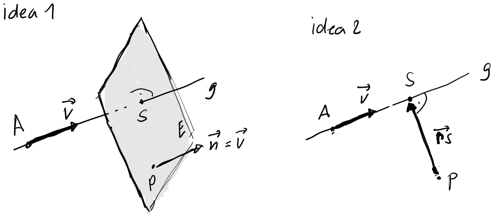

---
redirect_from:
  - "/vectors/section14-intersectionlineplane"
interact_link: content/Vectors/section14_intersectionLinePlane.ipynb
kernel_name: python3
has_widgets: false
title: 'Intersecting a straight line and a plane'
prev_page:
  url: /Vectors/section13_planes.html
  title: 'Planes'
next_page:
  url: 
  title: ''
comment: "***PROGRAMMATICALLY GENERATED, DO NOT EDIT. SEE ORIGINAL FILES IN /content***"
---


## The intersection between a line and a plane
---

Consider a straight line $g$ that passes through the point $U$ and has direction vector $\vec{v}$, and a plane $E$ that contains the point $A$ and has normal vector $\vec{n}$. What is the relationship between $g$ and $E$? There are three possibilities:

1. $g$ is __parallel__ to $E$, in which case it is (see figure)

   $$\nonumber\vec{v} \perp \vec{n}$$
   
   Note how we can distinguish whether $g$ is actually __in__ the plane, or __not in__ the plane. In the first case it is $\overrightarrow{AU} \perp \vec{n}$, and in the second case it is $\overrightarrow{AU} \not\perp \vec{n}$.

   

2. $g$ is not parallel to $E$, in which case there is an intersection point $S$ between $g$ and $E$.

	
	
    To find the intersection point $S$ note that $S\in g$ and $S\in E$:

    $$\nonumber \boxed{\overrightarrow{US} \parallel \vec{v}\, \mbox{ and }\, \overrightarrow{AS} \perp \vec{n} }$$ 

    And these two conditions are sufficient to determine the coordinates of $S$.


### Example 1
---

Plane $E$ contains the point $A(0\vert 0\vert 9)$ and has normal vector $\vec{n}=\left(\begin{array}{r} 1\\\ 4\\\ -3 \end{array}\right)$ Straight line $g$ passes through the point $U(7\vert 2\vert 9)$ and has direction vector $\vec{v}=\left(\begin{array}{r} -2\\\ 3\\\ 4 \end{array}\right)$. Find the intersection point $S$ between $g$ and $E$.


### Solution


 - $g$ is not parallel to $E$, as $\nonumber \vec{v}\bullet \vec{n}=-2+12-12=2\neq 0$, so there is a single intersection point $S(x\vert y\vert z)$ 

- $S \in g \rightarrow \overrightarrow{US} \parallel \vec{v} \rightarrow \overrightarrow{US}=c\cdot \vec{v}$. So 

  $$\nonumber \left(\begin{array}{r} x-7\\\ y-2\\\ z-9 \end{array}\right) = \left(\begin{array}{r} 2c\\\ 3c\\\ 4c \end{array}\right) \rightarrow x=-2c+7, y=3c+2, z=4c+9$$


- $S \in E \rightarrow \overrightarrow{AS} \perp \vec{n} \rightarrow \overrightarrow{AS} \bullet \vec{n} = 0$. So

  $$\nonumber \left(\begin{array}{r} x-0\\\ y-0\\\ z-9 \end{array}\right) \bullet \left(\begin{array}{r} 1\\\ 4\\\ -3 \end{array}\right) = 0 \rightarrow x + 4y -3(z-9) = 0$$
  
  Using the fact that $x=-2c+7, y=3c+2$ and $z=4c+9$, and inserting this into the equation above, we get
  
  $$\nonumber  -2c+7+4(3c+2)-3(4c+9-9) = -2c+15=0 \rightarrow c=7.5$$
  
  It follows $x=-2\cdot 7.5+7=-8, y=3\cdot 7.5+2=24.5, z=4\cdot 7.5+9=39 \rightarrow S(-8|24.5|39)$ 
   

### Example 2
---

Plane $E$ contains the point $A(4\vert 4\vert 2)$ and has normal vector $\vec{n}=\left(\begin{array}{r} -2\\\ -2\\\ 3 \end{array}\right)$ Straight line $g$ passes through the point $U(1\vert 2\vert -3)$ and has direction vector $\vec{v}=\left(\begin{array}{r} 1\\\ 1\\\ 2 \end{array}\right)$. Find the intersection point $S$ between $g$ and $E$.

### Solution
---

 - $g$ is not parallel to $E$, as $\vec{v}\bullet \vec{n}=2\neq 0$, so there is a single intersection point $S(x\vert y\vert z)$ 

- $S \in g \rightarrow \overrightarrow{US} \parallel \vec{v} \rightarrow \overrightarrow{US}=c\cdot \vec{v}$. So 

  $$\nonumber \left(\begin{array}{r} x-1\\\ y-2\\\ z+3 \end{array}\right) = \left(\begin{array}{r} c\\\ c\\\ 2c \end{array}\right) \rightarrow x=c+1, y=c+2, z=2c-3$$


- $S \in E \rightarrow \overrightarrow{AS} \perp \vec{n} \rightarrow \overrightarrow{AS} \bullet \vec{n} = 0$. So

  $$\nonumber \left(\begin{array}{r} x-4\\\ y-4\\\ z-2 \end{array}\right) \bullet \left(\begin{array}{r} -2\\\ -2\\\ 4 \end{array}\right) = 0 \rightarrow -2(x-4) -2(y-4)+4(z-2) = 0$$
  
  Inserting the expression for $x, y$, and $z$, we get
  
  $$\nonumber -2(c+1-4)-2(c+2-3)+4(2c-3-2) = 4c-10=0 \rightarrow c=2.5$$
  
  It follows $x=2.5+1=3.5, y=c+2=4.5, z=2\cdot 2.5-3=2 \rightarrow S(3.5\vert 4.5 \vert 2)$ 


## Exercise
---

1. Plane $E$ contains the point $A(0\vert 0\vert 9)$ and has normal vector $\vec{n}=\left(\begin{array}{r} 0\\\ 4\\\ -3 \end{array}\right)$ THe straight line $g$ passes through the point $U(7\vert 2\vert 9)$ and has direction vector $\vec{v}=\left(\begin{array}{r} -2\\\ 3\\\ 4 \end{array}\right)$ Find the intersection point between $g$ and $E$.

2. _Shortest distance between a point and a plane._ Consider the plane $E$ containing the point $A(5\vert 2\vert -3)$ and with normal vector $\vec{n}=\left(\begin{array}{r} 2\\\ 3\\\ 1 \end{array}\right)$. Find the shortest distance between point $P(1\vert -1 \vert -2)$ and plane $E$.


## Solution
---
1. There is no intersection point, as $g$ and $E$ are parallel ($\vec{v}\bullet \vec{n}=0+12-12=0$) and $g$ is not in $E$ ($\overrightarrow{AU} \bullet \vec{n} = 0+8+0 \neq 0$). Note that if you try to calculate the coordinates of the intersection point, you end up with the equation 

   $$\nonumber 0 + 12c+8 -12c = 0\rightarrow 8=0 \,???$$
  
   So the assumption of the existence of an intersection point $S$ leads to a contradiction. So there is no intersection point.

2. The idea is to take the straight line $g$ that passes through $P$ and is orthogonal to $E$, and intersect this line with the plane to get intersection point $S$. The distance between $S$ and point $A$ is then the shortest distance (see figure).

   

    
   - Determine $g$: $g$ passes through point $P$ and has direction vector $\vec v = \vec{n}$ (as it is orthogonal to $E$). 
   - Intersect $g$ with $E$ to get $S(x\vert y\vert z)$: 

     $S\in g \rightarrow \overrightarrow{PS}=c\cdot \vec{v} \rightarrow \left(\begin{array}{r} x-1\\\ y+1\\\ z+2 \end{array}\right)=\left(\begin{array}{r} 2c\\\ 3c\\\ c \end{array}\right) \rightarrow x=2c+1, y=3c-1, z=c-2$
     
     $S \in E \rightarrow \overrightarrow{AS} \bullet \vec{n} = 0 \rightarrow \left(\begin{array}{r} x-5\\\ y-2\\\ z+3 \end{array}\right) \bullet \left(\begin{array}{r} 2\\\ 3\\\ 1 \end{array}\right)= 2(x-5)+3(y-2)+z+3=0$  
     
     Inserting the expression for $x$, $y$ and $z$, we get 
     
     $$2(2c+1-5)+3(3c-1-2)+c-2+3 = 14c-16=0 \rightarrow c=\frac{16}{14}=\frac{8}{7}$$  
     
     Thus, $x=2\cdot 8/7+1=23/7, y=3\cdot 8/7-1=17/7, z=8/7-2=-6/7 \rightarrow S(\frac{23}{7}|\frac{17}{7}|-\frac{6}{7})$.
     
   - The shortest distance is therefore $d=\vert\overrightarrow{PS}\vert=\left\vert\left(\begin{array}{r} 23/7-1\\\ 17/7+1\\\ -6/7+2 \end{array}\right)\right\vert =  \sqrt{896/49}$


<div markdown="1" class="cell code_cell">
<div class="input_area" markdown="1">
```python
#needs to be in the last cell for css styling
from IPython.core.display import HTML
def css_styling():
    styles = open("../assets/custom/custom.css", "r").read()
    return HTML(styles)
css_styling()

```
</div>

<div class="output_wrapper" markdown="1">
<div class="output_subarea" markdown="1">


<div markdown="0" class="output output_html">
<style>

    @font-face {
     font-family: 'sf-display';
     font-weight: normal;
     font-style: normal;
     src: url('fonts/sf-display/SanFranciscoDisplay-Regular.otf') format('opentype');
    }

    @font-face {
     font-family: 'sf-display';
     font-weight: normal;
     font-style: italic;
     src: url('fonts/sf-display/SanFranciscoDisplay-RegularItalic.otf') format('opentype');
    }

    @font-face {
     font-family: 'sf-display';
     font-weight: bold;
     font-style: normal;
     src: url('fonts/sf-display/SanFranciscoDisplay-Bold.otf') format('opentype');
    }

    @font-face {
     font-family: 'sf-display';
     font-weight: bold;
     font-style: italic;
     src: url('fonts/sf-display/SanFranciscoDisplay-BoldItalic.otf') format('opentype');
    }

    @font-face {
     font-family: 'cmu-text-decorated';
     font-weight: normal;
     font-style: italic;
     src: url('fonts/cmu-text/CMUSerif-UprightItalic.otf') format('opentype');
    }

    @font-face {
     font-family: 'cmu-text';
     font-weight: normal;
     font-style: normal;
     src: url('fonts/cmu-text/CMUSerif-Roman.otf') format('opentype');
    }

    @font-face {
     font-family: 'cmu-text';
     font-weight: normal;
     font-style: italic;
     src: url('fonts/cmu-text/CMUSerif-Italic.otf') format('opentype');
    }

    @font-face {
     font-family: 'cmu-text';
     font-weight: bold;
     font-style: normal;
     src: url('fonts/cmu-text/CMUSerif-BoldNonextended.otf') format('opentype');
    }

    @font-face {
     font-family: 'cmu-text';
     font-weight: bold;
     font-style: italic;
     src: url('fonts/cmu-text/CMUSerif-BoldItalic.otf') format('opentype');
    }

    @font-face {
     font-family: 'sf-mono';
     font-weight: normal;
     font-style: normal;
     src: url('fonts/sf-mono/SFMono-Regular.otf') format('opentype');
    }

    @font-face {
     font-family: 'sf-mono';
     font-weight: normal;
     font-style: italic;
     src: url('fonts/sf-mono/SFMono-RegularItalic.otf') format('opentype');
    }

    @font-face {
     font-family: 'sf-mono';
     font-weight: bold;
     font-style: normal;
     src: url('fonts/sf-mono/SFMono-Bold.otf') format('opentype');
    }

    @font-face {
     font-family: 'sf-mono';
     font-weight: bold;
     font-style: italic;
     src: url('fonts/sf-mono/SFMono-BoldItalic.otf') format('opentype');
    }


    div.cell{
        width:800px;
        margin-left:16% !important;
        margin-right:auto;
    }
    h1 {
        font-family:  "cmu-text", "Times New Roman", serif !important;
    }
    h2 {
        font-family:  "cmu-text", Helvetica, "Times New Roman", serif !important;
	      color: blue
    }
    h3 {
      font-family:  "cmu-text", serif !important;
        color: gray
    }
    h4{
      font-family:  "cmu-text", "Times New Roman", serif !important;
        margin-top:12px;
        margin-bottom: 3px;
    }
    div.text_cell_render{
        /* font-family: Computer Modern, serif; */
        font-family: "cmu-text", Helvetica, serif !important;
        line-height: 145%;
        font-size: 130%;
        width:800px;
        margin-left:auto;
        margin-right:auto;
    }
    .CodeMirror{
            font-family: "Source Code Pro", source-code-pro,Consolas, monospace;
    }
    .prompt{
        display: None;
    }
    .text_cell_render h5 {
        font-weight: 300;
        font-size: 22pt;
        color: #4057A1;
        font-style: italic;
        margin-bottom: .5em;
        margin-top: 0.5em;
        display: block;
    }

    .warning{
        color: rgb( 240, 20, 20 )
        }

    .MathJax {
        font-size: 1em;
    }

    div.important {
       background-color: #fcf2f2;
       border-color: #dFb5b4;
       border-left: 5px solid #dfb5b4;
       padding: 0.5em;
    }

    div.exc {
       background-color: lightgray;
       border-color: lightgray;
       border-left: 5px solid gray;
       padding: 0.5em;
    }

    div.sol {
       background-color: lightgray;
       border-color: lightgray;
       border-left: 5px solid gray;
       padding: 0.5em;
    }

    li{
       margin: 10px 0;
    }

    ol ol { list-style-type: upper-alpha; important! }
    ol ol ol { list-style-type: lower-alpha; important! }

</style>
<script>
    MathJax.Hub.Config({
                TeX: {
                        extensions: ["AMSmath.js"],
			          Macros: {
      				          RR: '{\\bf TOM}',                // a simple string replacement
      				          bold: ['\\boldsymbol{#1}',1]   // this macro has one parameter
    			              }
                },
		tex2jax: {
            		inlineMath: [ ["$","$"], ["\\(","\\)"] ],
                displayMath: [ ["$$","$$"], ["\\[","\\]"] ],
            		processEscapes: true,
            		processEnvironments: true
        	},
                "HTML-CSS": {
                    styles: {'.MathJax_Display': {"margin": 0}},
                    availableFonts: ["TeX","STIX-Web","Neo-Euler"],
                    preferredFont: "Neo-Euler",
                },
        });
</script>

</div>


</div>
</div>
</div>

