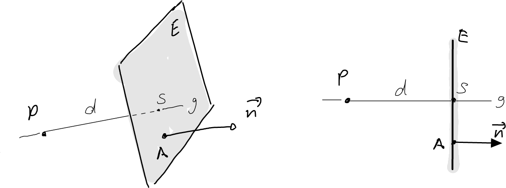

---
redirect_from:
  - "/vectors/section15-distanceproblems"
interact_link: content/Vectors/section15_distanceProblems.ipynb
kernel_name: python3
has_widgets: false
title: 'Distance problems'
prev_page:
  url: /Vectors/section14_intersectionLinePlane.html
  title: 'Intersecting straight lines and planes'
next_page:
  url: /Vectors/section16_vectorProblems.html
  title: 'Vector product'
comment: "***PROGRAMMATICALLY GENERATED, DO NOT EDIT. SEE ORIGINAL FILES IN /content***"
---

## Distance between a point and a plane
---

Consider the plane $E$ containing the point $A$ and with normal vector $\vec{n}$. Find the shortest distance between a given point $P$ and plane $E$. 

_Idea:_ Take the straight line $g$ that passes through $P$ and is orthogonal to $E$, and intersect this line with the plane to get intersection point $S$. The distance between $S$ and point $A$ is then the shortest distance (see figure).

   
   
### Example
---

Plane $E$ contains the point $A(5\vert 2\vert -3)$ and has normal vector $\vec{n}=\left(\begin{array}{r} 2\\\ 3\\\ 1 \end{array}\right)$. Find the shortest distance between point $P(1\vert -1 \vert -2)$ and plane $E$. 

### Solution
----
    
- Determine $g$: $g$ passes through point $P$ and has direction vector $\vec v = \vec{n}$ (as it is orthogonal to $E$).

- Intersect $g$ with $E$ to get $S(x\vert y\vert z)$: 

  $S\in g \rightarrow \overrightarrow{PS}=c\cdot \vec{v} \rightarrow \left(\begin{array}{r} x-1\\\ y+1\\\ z+2 \end{array}\right)=\left(\begin{array}{r} 2c\\\ 3c\\\ c \end{array}\right) \rightarrow x=2c+1, y=3c-1, z=c-2$
     
  $S \in E \rightarrow \overrightarrow{AS} \bullet \vec{n} = 0 \rightarrow \left(\begin{array}{r} x-5\\\ y-2\\\ z+3 \end{array}\right) \bullet \left(\begin{array}{r} 2\\\ 3\\\ 1 \end{array}\right)= 2(x-5)+3(y-2)+z+3=0$  
     
  Inserting the expression for $x$, $y$ and $z$, we get 
     
  $$\nonumber 2(2c+1-5)+3(3c-1-2)+c-2+3 = 14c-16=0 \rightarrow c=\frac{16}{14}=\frac{8}{7}$$  
     
  Thus, $x=2\cdot 8/7+1=23/7, y=3\cdot 8/7-1=17/7, z=8/7-2=-6/7 \rightarrow S(\frac{23}{7}\vert \frac{17}{7}\vert -\frac{6}{7})$
     
- The shortest distance is therefore $d=\vert\overrightarrow{PS}\vert=\left\vert\left(\begin{array}{r} 23/7-1\\\ 17/7+1\\\ -6/7+2 \end{array}\right)\right\vert =  \sqrt{896/49}$

## Distance between a point and a straight line
---

Consider a straight line that passes through point $A$ and has direction $\vec v$. Find the shortest distance between a point $P$ and this line.

_Idea 1:_ take the plane $E$ that contains $P$ and has normal vector $\vec n = \vec v$, and intersect this plane with the straight line to get the intersection point $S$. The shortest distance is then the distance between $P$ and $S$.

_Idea 2:_ find a point $S$ on $g$ such that $\overrightarrow{PS} \perp \vec{v}$. The shortest distance is then the distance between $P$ and $S$.  

Both ideas lead to the same calculations.

### Example
---

The straight line $g$ passes through the point $A(2\vert 3\vert -5)$, and has direction vector $\vec{v} = \left(\begin{array}{r} 2\\\ 0\\\ -1 \end{array}\right)$. Find the shortest distance between the point $P(-2\vert -2\vert 4)$ and line $g$.

### Solution
---

- _Idea 1:_  Find the intersection point $S(x\vert y\vert z)$ between $g$ and $E$.

   $S\in g \rightarrow \overrightarrow{AS} = c\cdot \vec v \rightarrow \left(\begin{array}{r} x-2\\\ y-3\\\ z+5 \end{array}\right) = \left(\begin{array}{r} 2c\\\ 0\\\ -c \end{array}\right) \rightarrow x=2c+2, y=3, z=-c-5$ 
   
   $S\in E \rightarrow \overrightarrow{PS} \bullet \vec{n} =0\rightarrow \left(\begin{array}{r} x+1\\\ y+2\\\ z-4 \end{array}\right) \bullet \left(\begin{array}{r} 2\\\ 0\\\ -1 \end{array}\right) = 2(x+1)-(z-4) = 0$  
   
   Inserting the expressions for $x, y$ and $z$ from above, we obtain the equation
   
   $$\nonumber 2(2c+2+1)-(-c-5-4)=5c+15=0 \rightarrow c=3 \rightarrow S(8 \vert 3\vert -8)$$
   
   The shortest distance is 
   
   $$\nonumber \vert \overrightarrow{PS}\vert = \left\vert \left(\begin{array}{r} 9\\\ 5\\\ -12 \end{array}\right) \right\vert =\sqrt{250}$$

- _Idea 2:_ Find $S(x\vert y\vert z)$ with $S\in g$ and $\overrightarrow{PS} \bullet \vec{v}=0$

    $S\in g \rightarrow \overrightarrow{AS} = c\cdot \vec v \rightarrow \left(\begin{array}{r} x-2\\\ y-3\\\ z+5 \end{array}\right) = \left(\begin{array}{r} 2c\\\ 0\\\ -c \end{array}\right) \rightarrow x=2c+2, y=3, z=-c-5$ 
    
    $\overrightarrow{PS} \bullet \vec{v}= 0 \rightarrow \left(\begin{array}{r} x+1\\\ y+2\\\ z-4 \end{array}\right) \bullet \left(\begin{array}{r} 2\\\ 0\\\ -1 \end{array}\right) = 2(x+2)-(z-4) = 0$  
   
   Inserting the expressions for $x, y$ and $z$ from above, we obtain the equation
   
   $$\nonumber 2(2c+2+1)-(-c-5-4)=5c+15=0 \rightarrow c=3 \rightarrow S(8 \vert 3\vert -8)$$
   
   The shortest distance is 
   
   $$\nonumber \vert \overrightarrow{PS}\vert = \left\vert \left(\begin{array}{r} 9\\\ 5\\\ -12 \end{array}\right) \right\vert =\sqrt{250}$$

## Shortest distance between parallel planes
---

Pick a point on one of the planes, and find the shortest distance between this point and the other plane.

## Shortest distance between parallel lines
---

Pick a point on one of the lines and find the shortest distance between this point and the other straight line.

