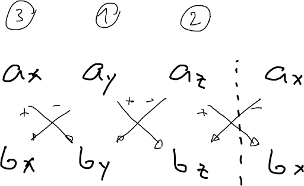
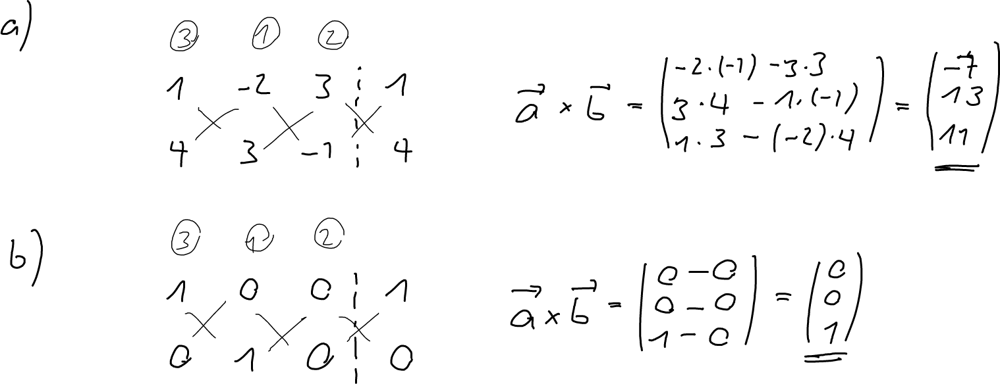
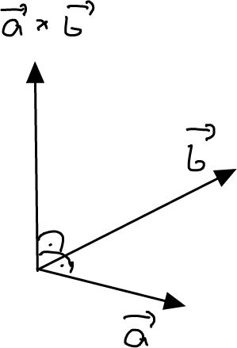
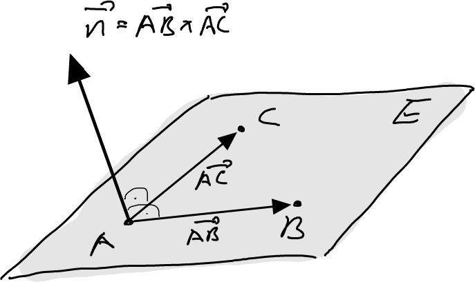
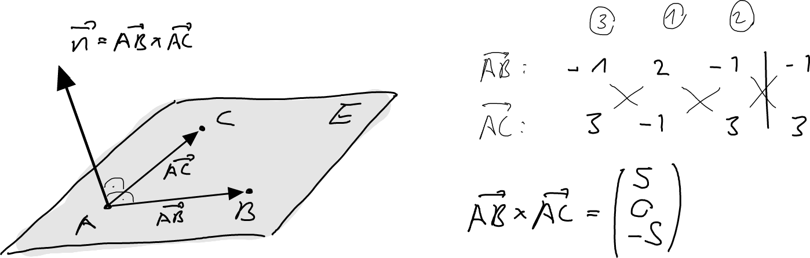

---
redirect_from:
  - "/vectors/section16-vectorproduct"
interact_link: content/Vectors/section16_vectorproduct.ipynb
kernel_name: python3
has_widgets: false
title: 'Vector product'
prev_page:
  url: /Vectors/section15_distanceProblems.html
  title: 'Distance problems'
next_page:
  url: /Vectors/section16_furtherProblems.html
  title: 'Further problems'
comment: "***PROGRAMMATICALLY GENERATED, DO NOT EDIT. SEE ORIGINAL FILES IN /content***"
---

## Vectorproduct
---

Consider two vectors $\vec{a}$ and $\vec{b}$. The __vector product__ (or __cross-product__) of $\vec{a}$ and $\vec{b}$, written $\vec{a} \times \vec{b}$ is a new vector that is defined as follows 

$$\nonumber \vec{a}\times \vec{b} = \left(\begin{array}{r} a_y b_z-a_z b_y \\ a_z b_x-a_x b_z \\ a_x b_y - a_y b_x \end{array}\right)$$ 

There are several methods for finding the components of the new vector. Here is one: 

### Example
---

Determine the vector product $\vec{a}\times \vec{b}$:
1. $\vec{a}=\left(\begin{array}{r} 1 \\ -2 \\ 3 \end{array}\right)$, $\vec{b}=\left(\begin{array}{r} 4 \\ 3 \\ -1 \end{array}\right)$

2. $\vec{a}=\left(\begin{array}{r} 1 \\ 0 \\ 0 \end{array}\right)$, $\vec{b}=\left(\begin{array}{r} 0 \\ 1 \\ 0 \end{array}\right)$

### Solution
---

## Finding the normal vector of a plane given by three points
---

The most important property of the vector product is that the vector $\vec{a}\times \vec{b}$ is orthogonal to _both_ vectors $\vec{a}$ and $\vec{b}$: 

$$\nonumber \boxed{(\vec{a}\times \vec{b}) \perp \vec{a} \, \mbox{ and }\, (\vec{a}\times \vec{b}) \perp \vec{b}}$$ 

This property can be used to find the normal vector $\vec n$ of a plane that is given by three points $A, B$ and $C$ (see figure below). 

Clearly we have 

$$\nonumber \vec n = \overrightarrow{AB} \times \overrightarrow{AC}$$

### Example
---

A plane contains the three points $A(1\vert -1\vert 2), B(4\vert 2\vert -1)$ and $C(-1 \vert 2\vert 4)$. Is the point $P(2.5\vert 1\vert 1.5)$ in the plane?

### Solution
---
We first find a normal vector $\vec n$ of $E$:

$$\nonumber \vec n = \overrightarrow{AB} \times \overrightarrow{AC} = \left(\begin{array}{r} 3 \\ 3 \\ -3 \end{array}\right) \times \left(\begin{array}{r} -2 \\ 3 \\ 2 \end{array}\right) = \left(\begin{array}{r} 15 \\  0\\ 15 \end{array}\right)$$

We can choose this vector, or any other that is collinear to this one, e.g. $\vec n = \left(\begin{array}{r} 1 \\  0\\ 1 \end{array}\right)$. We take the latter one, as there is less to calculate. Because of

$$\nonumber \overrightarrow{AP} \bullet \vec n = \left(\begin{array}{r} 1.5 \\  2\\ -0.5 \end{array}\right) \bullet \left(\begin{array}{r} 1 \\  0\\ 1 \end{array}\right) = 1\neq 0$$ 

it follows that $P\not\in E$.

## Exercise
---

1. Proof that $(\vec a \times \vec b) \perp \vec a$ and $(\vec a \times \vec b) \perp \vec b$

2. A plane $E$ contains the three points $A(1\vert -1 \vert 2)$, $B(0\vert 1\vert 1)$, and $C(4\vert -2\vert 5)$. Determine a normal vector of $E$.

## Solution
---

1. We have to show that $(\vec{a}\times \vec{b})\bullet \vec{a}=0$.

    $$\begin{array}{lll}
    (\vec{a}\times \vec{b})\times \vec a & = & \left(\begin{array}{r} a_y b_z-a_z b_y \\ a_z b_x-a_x b_z \\a_x b_y - a_y b_x\end{array}\right) \bullet \left(\begin{array}{r} a_x \\  a_y\\ a_z \end{array}\right)\\ 
    & = & a_y b_z a_x -a_z b_y a_x + a_z b_x a_y -a_x b_z a_y + a_x b_y a_z - a_y b_x a_z \\
    & = & 0\end{array}$$ 
    
    A similar calculation shows that $(\vec{a}\times \vec{b})\bullet \vec{a}=0$.
    
2. A normal vector of $E$ is 

    $$\nonumber\vec{n}=\overrightarrow{AB} \times \overrightarrow{AC} = \left(\begin{array}{r} -1 \\ 2 \\ -1 \end{array}\right) \times \left(\begin{array}{r} 3 \\ -1 \\ 3 \end{array}\right) = \left(\begin{array}{r} 5 \\  0\\ -5 \end{array}\right)$$ 
    
    
    
    A simpler normal vector is the collinear vector $\vec n = \left(\begin{array}{r} 1 \\\ 0 \\\ -1 \end{array}\right)$.

