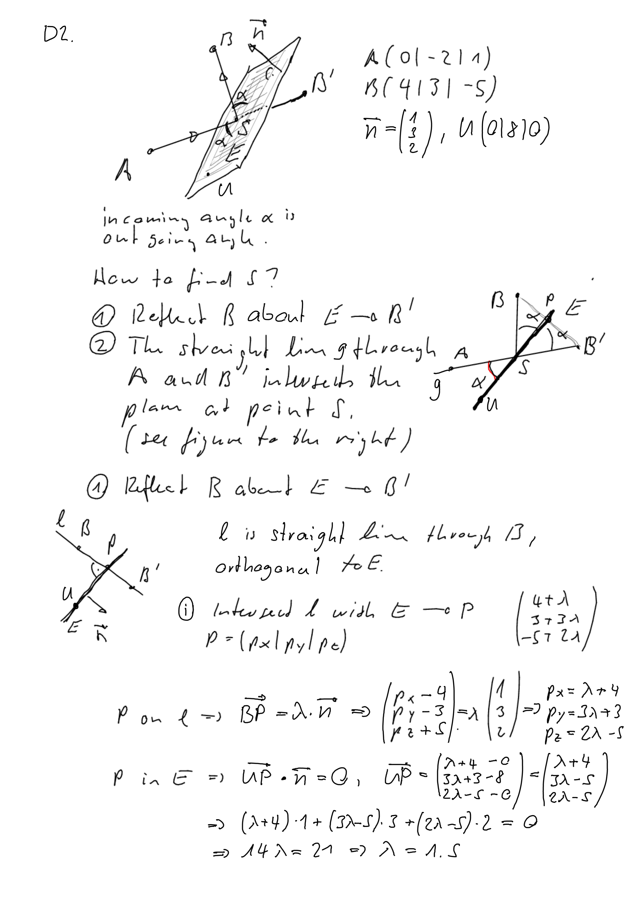

---
redirect_from:
  - "/vectors/section17-furtherproblems"
interact_link: content/Vectors/section17_furtherProblems.ipynb
kernel_name: python3
has_widgets: false
title: 'Further problems'
prev_page:
  url: /Vectors/section18_lightreflection.html
  title: 'Reflection of light'
next_page:
  url: /Calculus/section1_whycalc.html
  title: 'Differential calculus'
comment: "***PROGRAMMATICALLY GENERATED, DO NOT EDIT. SEE ORIGINAL FILES IN /content***"
---

## Further Problems C (basic-intermediate)
---

1. Calculate the angle between $\vec{a}=\left(\begin{array}{r} 4 \\\  -2\\\ 1 \end{array}\right)$ and the three coordinate axes.

2. Find a value for $z$ such that the angle between $\vec{a}=\left(\begin{array}{r} 1 \\\  0\\\ z \end{array}\right)$ and $\vec{b}=\left(\begin{array}{r} 0 \\\  1\\\ z \end{array}\right)$ is $60^\circ$.

3. Find possible values for $u$ such that $\vec{a}=\left(\begin{array}{r} 2 \\\  -1\\\ 7 \end{array}\right)$ and $\vec{b}=\left(\begin{array}{r} 5 \\\  3\\\ u \end{array}\right)$ are orthogonal.

4. Consider the points $A(4\vert 2\vert 8)$ and $B(6\vert 5\vert -3)$. Find a point $P$ on the y-axis such that the vectors $\overrightarrow{PA}$ and $\overrightarrow{PB}$ are orthogonal.

5. Consider the triangle $ABC$ where $A(2\vert -3 \vert 4)$ and $B(7\vert 9 \vert 6)$. The vertex $C$ is on the straight line that passes through the points $P(-1\vert 1\vert 4)$ and $Q(-1\vert 1 \vert 5)$. Calculate the coordinates of $C$ such that
	1. $ABC$ has a right angle at $C$.
	2. $ABC$ is an isosceles triangle.
   Also, in each case determine the triangle area.

6. Determine if the point $P(1 \vert -1 \vert3)$ is on the straight line $g$, where 
    1. $g$ passes through the points $A(-1\vert 1\vert 2)$ and $B(5\vert 7\vert 5)$.
    2. $g$ passes through the point $A(2\vert -2\vert 2)$ and has direction vector $\vec{v}=\left(\begin{array}{r} 3 \\\  -3\\\ 3 \end{array}\right)$.
    3. $g$ passes through the point $A(1\vert 0 \vert 1)$ and is parallel to the straight line $h$, where $h$ passes through the points $C(1\vert 1\vert 1)$ and $D(1\vert -1\vert 5)$.

7. Determine the point of intersection and the angle of intersection between the straight lines $l_1$ and $l_2$, where $l_1$ passes through the points $A_1(-3\vert 5\vert -2)$ and $B_1(0\vert 0\vert 7)$, and $l_2$ passes through the points $A_2(-16\vert -6\vert 9)$ and $B_2(-8\vert -3\vert 8)$.

8. Consider a straight line $g$ that passes through the points $A(5\vert 9\vert z)$ and $B(2\vert 6\vert -8)$. Find a value for $z$ such that $g$ intersects the x-axis.

9. Mirror the point $S(5\vert 2\vert -1)$ about the straight line $g$ that passes through the points $A(2\vert -3\vert 6)$ and $B(6\vert 1\vert 8)$.

10. Determine if the point $P(2\vert 2\vert 1)$ is on plane $E$, where 
    1. $E$ contains the points $A(3\vert 1\vert 0)$, $B(1\vert -4\vert -2)$, and $C(10\vert 1\vert -3)$. 
	2. $E$ contains point $A(0\vert 4\vert 3)$ and is orthogonal to the straight line $g$, where $g$ passes through the points $U(-1\vert 6\vert -5)$ and $V(5\vert -2\vert 7)$.

11. Determine the relative position between the straight line $g$ and plane $E$, where $g$ passes through the points $A(2\vert 1\vert 0)$ and $B(-2\vert -2\vert -1)$, and $E$ contains point $C(11\vert 0\vert 0)$ and has normal vector $\vec{n}=\left(\begin{array}{r} 1 \\\  -2\\\ 2 \end{array}\right)$.

12. The straight line $g$ passes through the points $A(0\vert 0\vert 5)$ and $B(1\vert 1\vert 3)$. Plane $E$ contains the point $U(6\vert 0\vert 0)$ and has normal vector $\vec{n}=\left(\begin{array}{r} 1 \\\  -1\\\ 2 \end{array}\right)$. If it exists, determine the point of intersection between $g$ and $E$, and also the angle of intersection (smallest angle between $g$ and $E$).

13. A plane $E$ contains the point $A(0\vert 3\vert 0)$ and has the normal vector $\vec{n}=\left(\begin{array}{r} 2 \\\  3\\\ -8 \end{array}\right)$. Find the smallest distance between the origin and $E$.

14. Consider the straight line $g$ that passes through the point $A(1\vert 2\vert -3)$ and has direction vector $\vec{v}=\left(\begin{array}{r} 2 \\\  -2\\\ 3 \end{array}\right)$. Find the closest distance between point $P(1\vert -1\vert -1)$ and $g$. **Wrong minus sign in the solution, right solution is 2.13 ...**

15. A plane $E$ passes through the point $A(0\vert 5\vert 0)$ and has the normal vector $\vec{n}=\left(\begin{array}{r} 4 \\\  -3\\\ 0 \end{array}\right)$. Determine the smallest distance between point $P(4\vert 22\vert 3)$ and $E$.

16. A plane $E$ passes through the point $A(2\vert 1\vert 1)$ and has the normal vector $\vec{n}=\left(\begin{array}{r} 4 \\\  3\\\ 1 \end{array}\right)$. Determine the __trace points__ of $E$, that is, the intersection points of the plane with the three coordinate axes. Use these points to indicate the position of the plane in a 3d-drawing.

17. Plane $E$ passes through the point $A(5\vert 0\vert 5)$ and has the normal vector $\vec{n}=\left(\begin{array}{r} 8 \\\  4\\\ 1 \end{array}\right)$. The point $P(-3\vert -3\vert 0)$ is reflected about $E$ (so that it is on the other side of the plane). Determine the coordinates of the reflected point $P^\prime$.

18. An oblique pyramid has a triangular base $A(3\vert 0\vert 0)$, $B(0\vert 6\vert 0)$ and $C(0\vert 0\vert 9)$. The apex (or vertex, "Spitze") is at $S(13\vert 8\vert 7) $. Determine the volume of the pyramid.

19. A right pyramid of height $h=9$ has a square base with corner points $A(3\vert 5\vert 5)$, $B(1\vert 1\vert 1)$, $C(5\vert 3\vert -3)$ and $D$. Determine the coordinates of the apex $S$.

20. An air traffic controller is sitting at the origin of a coordinate system. At $t=0\, min$ she   observes an aeroplane $P_1$ at point $A(2\vert 1\vert 1)$ (in $km$). It is travelling in a straight line at a constant speed of $\vec{v}=\left(\begin{array}{r} 2 \\\  2\\\ 1 \end{array}\right)$ (in $km/min$).

    1. Determine the position of $P_1$ three minutes later.
    
    2. At what time was $P_1$ closest to the origin?
    
    3. The monitored space stretches from the origin over $50 km$ in all directions. When will the plane leave this region.
    
    4. At time $t=0 min$, when $P_1$ is at $A$, a second plane $P_2$ is at $B(1\vert 2\vert 5)$ (in $km$). Three minutes later $P_2$ is found at $C(4\vert 5\vert 2)$ (in $km$). Is it possible that the two aeroplanes can crash into each other?
 
 
## Further Problems D (advanced)
---

1. Consider the straight lines $l_1$ and $l_2$, where $l_1$ passes through the points $A_1(-1\vert 0\vert 3)$ and $B_1(-1\vert 1\vert 4)$, and $l_2$ passes through the points $A_2(3\vert 2\vert 1)$ and $B_2(9\vert 1\vert 3)$. Show that the lines are skew, and determine the smallest distance between them.

2. A mirror contains the point $U(0\vert 8\vert 0)$ and has normal vector $\vec{n}=\left(\begin{array}{r} 1 \\\  3\\\ 2 \end{array}\right)$. A ray of light passes through the point $A(0\vert 2\vert 1)$ and hits there mirror where it is reflected. The reflected ray passes through the point $B(4\vert 3\vert -5)$. Where does the ray of light hit the mirror?

3. The point $V(-7\vert -3\vert 14)$ is the vertex of a right circular cone (see figure). Point $M(3\vert -1\vert 3)$ is the centre of the the base circle, and point $P(1\vert -1\vert 8)$ lies on the cone surface. Calculate the volume of the cone.

## Solutions
---

