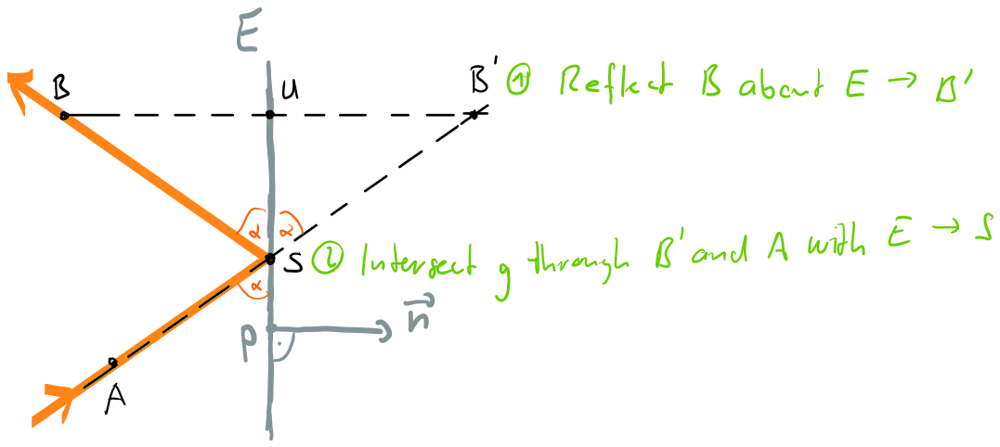
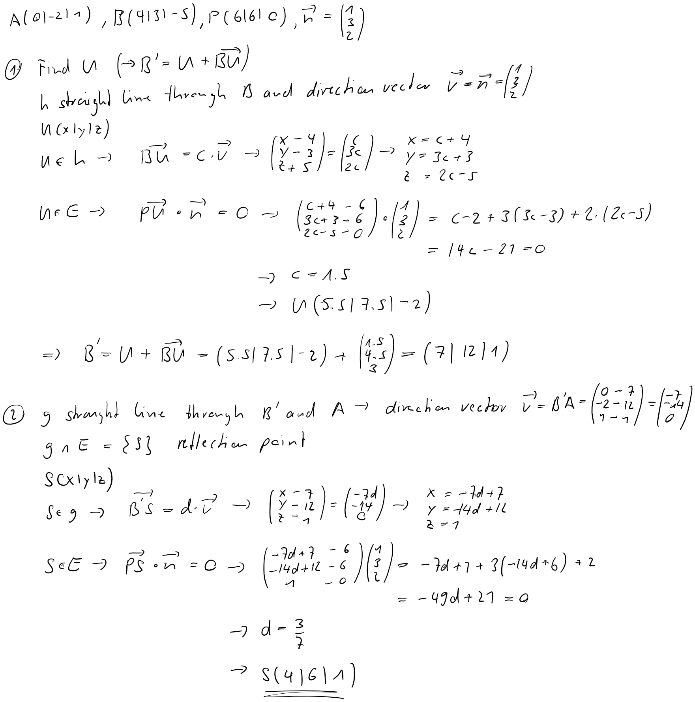

---
redirect_from:
  - "/vectors/section18-lightreflection"
interact_link: content/Vectors/section18_lightreflection.ipynb
kernel_name: python3
has_widgets: false
title: 'Reflection of light'
prev_page:
  url: /Vectors/section16_vectorproduct.html
  title: 'Vector product'
next_page:
  url: /Vectors/section17_furtherProblems.html
  title: 'Further problems'
comment: "***PROGRAMMATICALLY GENERATED, DO NOT EDIT. SEE ORIGINAL FILES IN /content***"
---

## Reflection of light
---

It is well known from physics that if a ray of light hits a mirror, they ray is reflected in such a way that the angle between the mirror and the incoming ray equals the angle between the mirror and the outgoing ray. This fact makes it possible to actually calculate the outgoing ray. Consider the construction below.

### Exercise
---

A ray of light passes through the point $A(0\vert -2\vert 1)$, and hits a mirror. The reflected light passes through point $B(4\vert 3\vert -5)$. Find the point of reflection $S$ on the mirror, given that the mirror contains the point $P(6 \vert 6\vert 0)$ and has a normal vector $\vec n = \left(\begin{array}{r} 1 \\\  3\\\ 2 \end{array}\right)$.

---

### Solution
---

