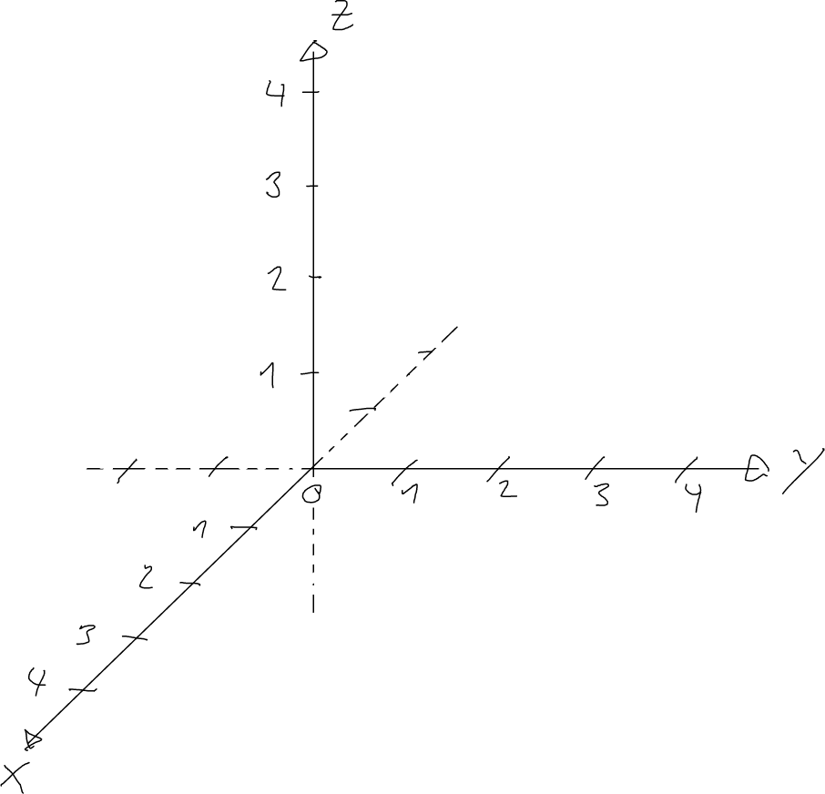
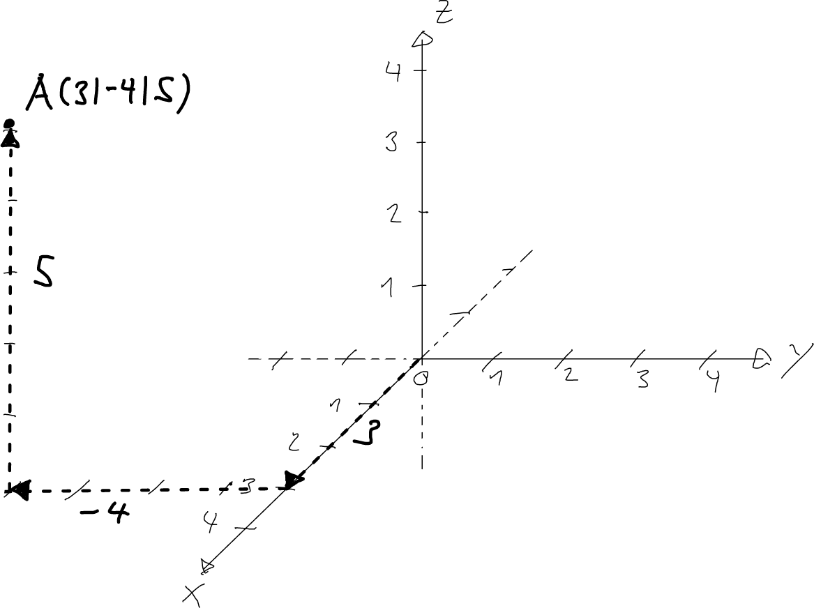
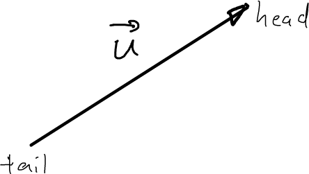
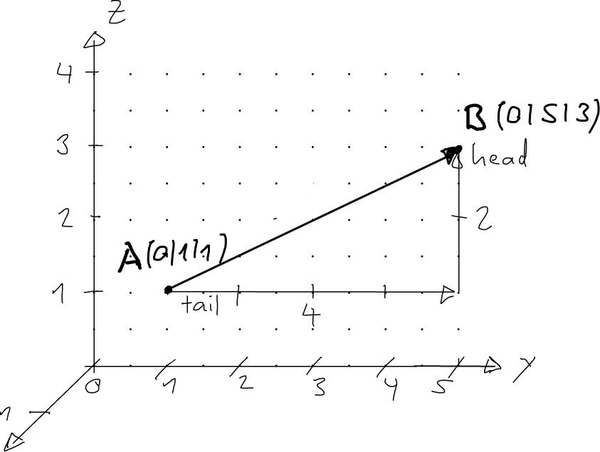
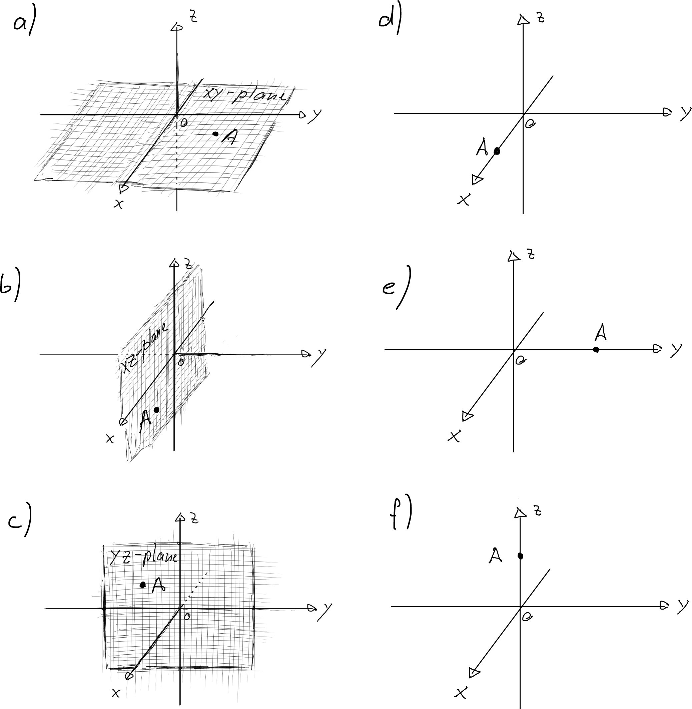
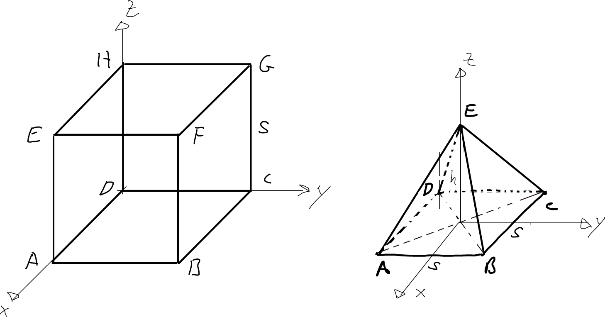
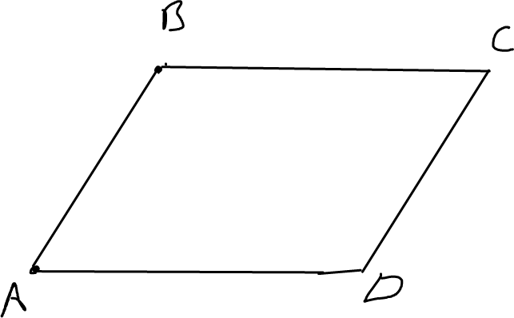
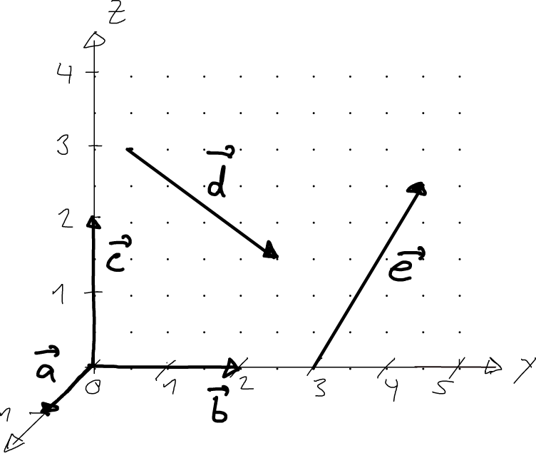
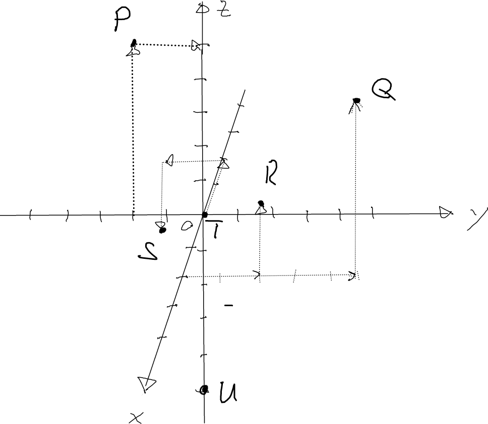
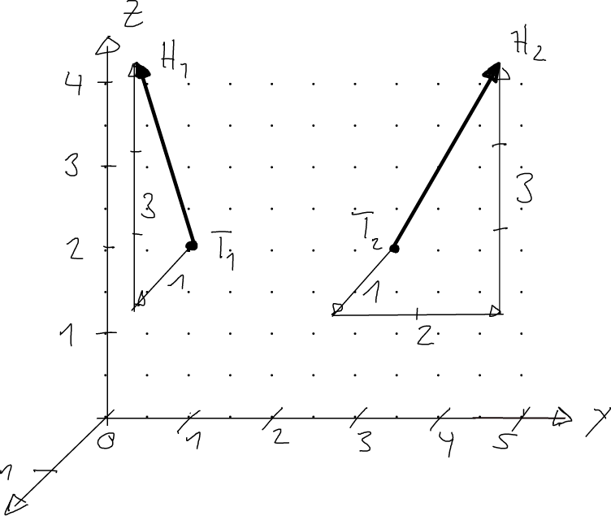

---
redirect_from:
  - "/vectors/section1-points-and-vectors"
interact_link: content/Vectors/section1_points_and_vectors.ipynb
kernel_name: python3
has_widgets: false
title: 'Points and vectors'
prev_page:
  url: /msg.html
  title: 'Vectors'
next_page:
  url: /Vectors/section2_magnitude.html
  title: 'The magnitude of a vector'
comment: "***PROGRAMMATICALLY GENERATED, DO NOT EDIT. SEE ORIGINAL FILES IN /content***"
---


## 3d-Coordinate systems
---

To describe geometrical objects in space with the help of coordinates, we need a *three dimensional* coordinate system for reference. We use the convention that:
- the $x$-axis points forward
- the $y$-axis points to the right
- the $z$-axis points upwards




## Points
---

A __point__ $A$ with the __coordinates__ $x, y$ and $z$, written $A(x \lvert y \lvert z)$, indicates a *position* in space relative to the coordinate system. For example, point $A(3 \lvert 4 \lvert 5)$ can be found as follows: Starting at the origin, 
- walk $3$ units along the $x$-direction (towards me), and from there
- walk $4$ units along the $y$-direction (to the right), and from there
- walk $5$ units along the $z$-direction (upwards)

Negative coordinates are also allowed and indicate to move into the opposite axis direction. For example, moving $z=-3$ units along the $z$-direction means moving $3$ units downwards.



Note:
 - The point with the coordinates $O(0 \lvert 0 \lvert 0)$ is called the __origin__ of the coordinate system.
 - We typically use capital letters to denote points ($A, B , U, ...$)


## Vectors
---

A __vector__ $\vec v$ with __components__ $x, y$, and $z$, written $$\vec{u}=\left(\begin{array}{r} x\\y\\z \end{array}\right)$$ represents an *arrow* in space. An arrow has a tail, a head, and a specific length and direction.



So how do three components define an arrow in space? We interpret the three numbers as instructions of how to get from the tail of the arrow its head. For example, take the vector $$\vec{u}=\left(\begin{array}{r} 2\\4\\5 \end{array}\right)$$ We will draw the arrow as follows: Pick any location in space for the tail of the arrow, then find the arrow head by
- move $2$ units in $x$-direction, from there
- move $4$ units in $y$-direction, and from there
- move $5$ units in $z$-direction

<div class="important">
Note: the three components of a vector do not tell you where the arrow is in space.
</div>

We have seen that a vector represents an arrow. The opposite is also true. For every arrow we draw in space, we can find the three components of a vector that represents this arrow - just find out how to get from the tail of the arrow to the head of the arrow by following along the $x$-axis, $y$-axis and $z$-axis. For example, assume that for the arrow the tail is at $A(0 \lvert 1 \lvert 1)$ and the head at $B(0 \lvert 5 \lvert 3)$. 



To get from $A$ to $B$, we have to walk along the $x$ axis by $0$ units, along the $y$-axis by $4$ units, and along the $z$-axis by $2$ units:

 $A$ | $\rightarrow$  | $B$
 ---|---|---
 $0$  | $\overset{+0}{\rightarrow}$  | $0$
 $1$  | $\overset{+4}{\rightarrow}$  | $5$
 $1$  | $\overset{+2}{\rightarrow}$  | $3$
 
So the vector representing this arrow is $$\vec{u}=\left(\begin{array}{r} 0\\4\\2 \end{array}\right)$$

Notes:
 - We typically use small letters with an arrow pointing to the right on top of it to denote vectors ($\vec a, \vec u, ...$). 
 - There is one exception: if the components of a vector arise from an arrow from a given point $A$ to a given point $B$, the vector is often denoted by $\overrightarrow{AB}$. In the example above, we could have written $$\overrightarrow{AB}=\left(\begin{array}{r} 0\\4\\2 \end{array}\right)$$
 - Two vectors are called __equal__ if their corresponding $x$-, $y$-, and $z$-components are equal.


<div class="exc">Exercise</div>

1. Determine all the coordinates of point $A$ that are zero. $A$ is either on the $xy$-plane, $xz$-plane, $yz$-plane, $x$-axis, $y$-axis, or $z$-axis.



2. Indicate the following points in a 3d-coordinate system:
 - $P(0|-2|5)$
 - $Q(2|5|5)$
 - $R(2|2|2)$
 - $S(-2|-2|2)$
 - $T(0|0|0)$
 - $U(0|0|-5)$


3. On which plane and/or axis are the following points: 
 - $U(0|1|2)$
 - $S(-1.3|1.2|0)$
 - $V(-13|0|0)$ 


4. Find the coordinates of all the corners of the cube of side length $5$, and of the pyramid of height $h=4$ and base side length $s=4$.



5. Draw the vectors $\left(\begin{array}{r} 1\\0\\3 \end{array}\right)$ and $\left(\begin{array}{r} 1\\2\\3 \end{array}\right)$ as arrows. Start anywhere in space.


6. Determine the vector $\overrightarrow{UV}$:
 - $U(1|2|-1)\,\,$ and $V(2|10|-3)$
 - $U(0|0|0)\,\,$ and $V(3|1|10)$
 - $U(-1.2|-3.1|5)\,\,$ and $V(2|2|1)$


7. If I start at point $A(0|1|0)\,\,$ and follow the components given by vector $\vec{u}=\left(\begin{array}{r} 1\\-1\\1 \end{array}\right)\,$ , where do I end up? Find the coordinates of this point $B$. Starting at $B$, what vector do I have to follow to get back to point $A$?


8. Consider the parallelogram with the vertices $A(1|4|1)$ , $B(0|3|2)$ , $C$ , and $D(2|3|0)$ , what are the coordinates of point $C$?



9. Determine the components of the arrows shown in the figure below. Vectors $\vec{a}$, $\vec{b}$, and $\vec{c}$ are on the $x$-axis, $y$-axis, and $z$-axis, and vectors $\vec{d}$ and $\vec{e}$ are in the $yz$-plane.



10. Consider the vectors $\left(\begin{array}{r} 0\\3\\4 \end{array}\right)$ and $\left(\begin{array}{r} 1\\4\\6 \end{array}\right)$ . Determine their lengths. Can you find a general formula for determining the length of a vector $\left(\begin{array}{r} x\\y\\z \end{array}\right)$ ?


11. Consider the vector $\left(\begin{array}{r} 0\\3\\4 \end{array}\right)$ . Find another vector that 
 - points into the same direction, and has twice the length.
 - points in the opposite direction and has half the length.
 - More generally, given a vector $\left(\begin{array}{r} x\\y\\z \end{array}\right)$ , what are the components of the vector pointing in the same direction and is $s$ times longer?


<div class="sol">Solutions</div>

1. a) $a) A_z=0, b) A_y=0, c) A_x=0, d) A_y=A_z=0, e) A_x=A_z=0, f) A_x=A_y=0$


2. 


3. $U$: $yz$-plane, $S$: $xy$-plane, $V$: $x$-axis, $xy$-plane, $xz$-plane.


4. Cube: $A(5|0|0), B(5|5|0), C(0|5|0), D(0|0|0), E(5|0|5), F(5|5|5), G(0|5|5), H(0|0|5)$ <br> 
Pyramid: $A(2|-2|0), B(2|2|0), C(-2|2|0), D(-2|-2|0), E(0|0|4)$


5. 


6. 


<div markdown="1" class="cell code_cell">
<div class="input_area" markdown="1">
```python
#needs to be in the last cell for css styling
from IPython.core.display import HTML
def css_styling():
    styles = open("../assets/custom/custom.css", "r").read()
    return HTML(styles)
css_styling()

```
</div>

<div class="output_wrapper" markdown="1">
<div class="output_subarea" markdown="1">


<div markdown="0" class="output output_html">
<style>
    @font-face {
        font-family: "Computer Modern";
        src: url('http://9dbb143991406a7c655e-aa5fcb0a5a4ec34cff238a2d56ca4144.r56.cf5.rackcdn.com/cmunss.otf');
    }
    @font-face {
        font-family: "Computer Modern";
        font-weight: bold;
        src: url('http://9dbb143991406a7c655e-aa5fcb0a5a4ec34cff238a2d56ca4144.r56.cf5.rackcdn.com/cmunsx.otf');
    }
    @font-face {
        font-family: "Computer Modern";
        font-style: oblique;
        src: url('http://9dbb143991406a7c655e-aa5fcb0a5a4ec34cff238a2d56ca4144.r56.cf5.rackcdn.com/cmunsi.otf');
    }
    @font-face {
        font-family: "Computer Modern";
        font-weight: bold;
        font-style: oblique;
        src: url('http://9dbb143991406a7c655e-aa5fcb0a5a4ec34cff238a2d56ca4144.r56.cf5.rackcdn.com/cmunso.otf');
    }
    div.cell{
        width:800px;
        margin-left:16% !important;
        margin-right:auto;
    }
    h1 {
        font-family: Helvetica, serif;
    }
    h2 {
        font-family: Helvetica, sans-serif;
	color: blue
    }
    h3 {
        
	color: gray
    }
    h4{
        margin-top:12px;
        margin-bottom: 3px;
       }
    div.text_cell_render{
        font-family: Computer Modern, sans-serif;
        line-height: 145%;
        font-size: 130%;
        width:800px;
        margin-left:auto;
        margin-right:auto;
    }
    .CodeMirror{
            font-family: "Source Code Pro", source-code-pro,Consolas, monospace;
    }
    .prompt{
        display: None;
    }
    .text_cell_render h5 {
        font-weight: 300;
        font-size: 22pt;
        color: #4057A1;
        font-style: italic;
        margin-bottom: .5em;
        margin-top: 0.5em;
        display: block;
    }
    
    .warning{
        color: rgb( 240, 20, 20 )
        }
  
    .MathJax {
        font-size: 1.05em;
    }

    div.important {    
       background-color: #fcf2f2;
       border-color: #dFb5b4;
       border-left: 5px solid #dfb5b4;
       padding: 0.5em;
    }

    div.exc {    
       background-color: lightgray;
       border-color: lightgray;
       border-left: 5px solid gray;
       padding: 0.5em;
    }

    div.sol {    
       background-color: lightgray;
       border-color: lightgray;
       border-left: 5px solid gray;
       padding: 0.5em;
    }

</style>
<script>
    MathJax.Hub.Config({
                        TeX: {
                           extensions: ["AMSmath.js"]
                           },
                tex2jax: {
                    inlineMath: [ ['$','$'], ["\\(","\\)"] ],
                    displayMath: [ ['$$','$$'], ["\\[","\\]"] ]
	            processEscapes: true
                },
                displayAlign: 'center', // Change this to 'center' to center equations.
                "HTML-CSS": {
                    styles: {'.MathJax_Display': {"margin": 4}}
                },
        });
</script>

</div>


</div>
</div>
</div>

