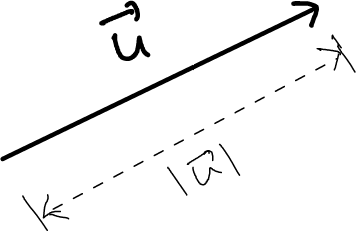
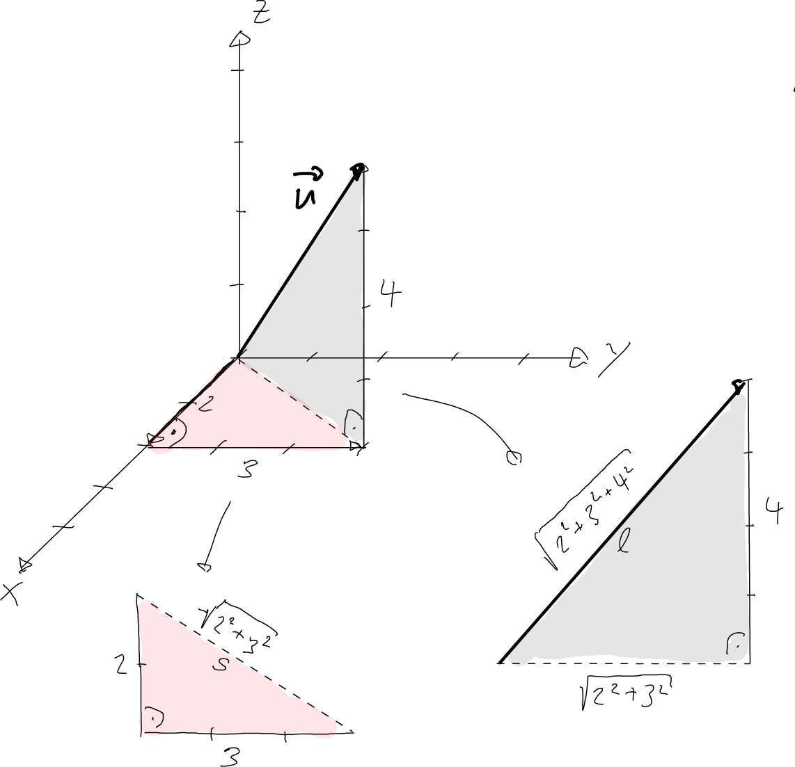

---
redirect_from:
  - "/vectors/section2-magnitude"
interact_link: content/Vectors/section2_magnitude.ipynb
kernel_name: python3
has_widgets: false
title: 'The magnitude of a vector'
prev_page:
  url: /Vectors/section1_points_and_vectors.html
  title: 'Points and vectors'
next_page:
  url: /Vectors/section3_special_vectors.html
  title: 'Three special vectors'
comment: "***PROGRAMMATICALLY GENERATED, DO NOT EDIT. SEE ORIGINAL FILES IN /content***"
---

## The magnitude of a vector
---

The __magnitude__ of a vector $\vec u$, written $\vert \vec{u} \vert$, is the *length of the arrow* that this vector represents. 

If the vector has the components 

$$\vec{u} =\left(\begin{array}{r} x\\y\\z \end{array}\right)$$ 

we can apply the theorem of Pythagoras twice to find the following formula for the magnitude: 

$$\boxed{|\vec u| = \sqrt{x²+y²+z²}}$$ 

A more detailed derivation of this formula is given in the figure below, for the vector with the components 

$$\vec{u} =\left(\begin{array}{r} 3\\4\\5 \end{array}\right)$$ 

In this case, the magnitude is $$\vert \vec{u}\vert = \sqrt{3²+4²+5²}=\sqrt{50}=7.071...$$

## Exercise
---

1. Determine the magnitude of the vectors $$\vec{w}=\left(\begin{array}{r} -1\\1\\-1 \end{array}\right)$$ and $$\vec{s}=\left(\begin{array}{r} 1.5\\0\\-2 \end{array}\right)$$

2. Vector $\vec{u}$ has the $x$-component $2$ and the $y$-component $-3$. Determine the $z$-component such that the magnitude of the vector is $32$ .

3. Determine the distance between the points $A(2|1|0)$  and $B(-7|2|5 )$. 

## Solutions
---

1. $\vert \vec{w}\vert =\sqrt{3}, \vert \vec{s}\vert =\sqrt{6.25}=2.5$

2. $\vert \vec{w}\vert =\sqrt{2^2+(-3)^2+z^2}=32 \rightarrow 2^2+(-3)^2+z^2=32^2=1024 \rightarrow z=\sqrt{1011}=31.796...$

3. The arrow from $A$ to $B$ has the components $$\overrightarrow{AB}=\left(\begin{array}{r} -9\\1\\5 \end{array}\right)$$. The distance between $A$ and $B$ is the length of this arrow: $$\vert \overrightarrow{AB}\vert =\sqrt{(-9)^2+1^2+5^2}=\sqrt{107}$$.

