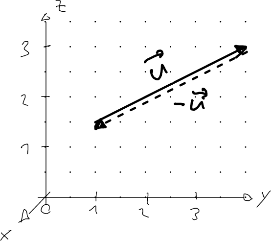
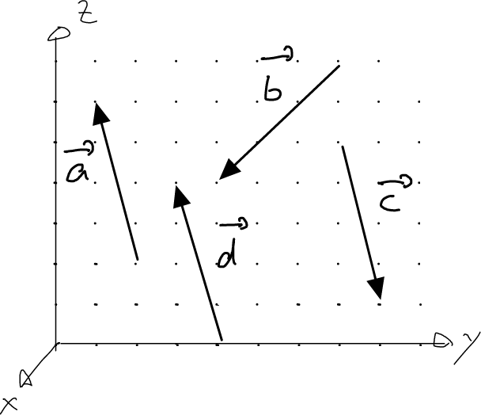
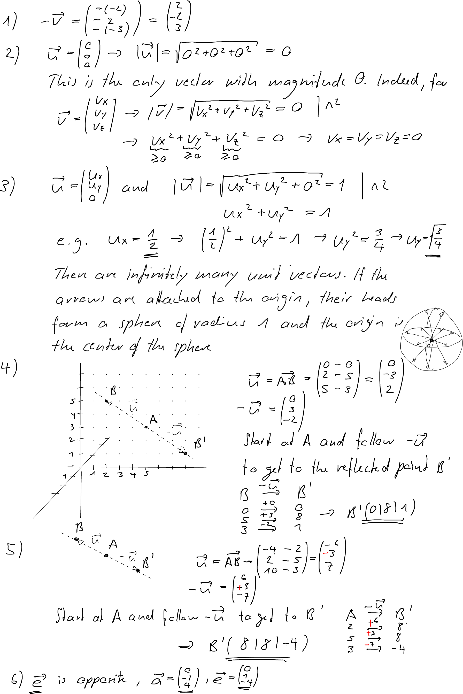

---
redirect_from:
  - "/vectors/section3-special-vectors"
interact_link: content/Vectors/section3_special_vectors.ipynb
kernel_name: python3
has_widgets: false
title: 'Three special vectors'
prev_page:
  url: /Vectors/section2_magnitude.html
  title: 'The magnitude of a vector'
next_page:
  url: 
  title: ''
comment: "***PROGRAMMATICALLY GENERATED, DO NOT EDIT. SEE ORIGINAL FILES IN /content***"
---


## Three special vectors
---
1. The __zero vector__ is the vector with the components $$\left(\begin{array}{r} 0\\0\\0 \end{array}\right)$$. Moving from head to tail along the zero-vector means moving not at all, as the tail and head occupy the same location. Clearly, the magnitude of the zero vector is $0$.

2. A __unit vector__ is a vector with magnitude $1$. 

3. Consider a vector $$\vec{u}=\left(\begin{array}{r} x\\y\\z \end{array}\right)$$ The __opposite vector__ of $\vec{u}$, written $-\vec{u}$, has the components $$-\vec{u}=\left(\begin{array}{r} -x\\-y\\-z \end{array}\right)$$ Clearly, the components of the opposite vector of $\vec u$ describe how to get from the head to the tail of the arrow represented by $\vec u$.



## Exercise
---

1. Determine the opposite vector of $\vec{v}=\left(\begin{array}{r} -2\\2\\-3 \end{array}\right)\,$ .
		
2. Determine the magnitude of the zero vector. How many other vectors of magnitude $0$ exist?

3. Determine a unit vector with at least $2$ non-zero components. How many unit vectors exist? If you attach the arrow of all these vectors to the origin, what geometrical object is formed by the arrow heads?

4. Consider the points $A(0|5|3)\,\,$ and $B(0|2|5)\,$. Reflect $B$ about $A$. What are the coordinates of the reflected point $B$ ? Hint: draw a figure.

5. Consider the points $A(2|5|3)\,\,$ and $B(-4|2|10)\,$ . Reflect $B$ about $A$. What are the coordinates of the reflected point $B$ ?

6. Which of these arrows in the yz-plane are described by the opposite vector of $\vec{a}$ Also, determine the components of $\vec{a}$ and $-\vec{a}$. 



## Solutions
---




<div markdown="1" class="cell code_cell">
<div class="input_area" markdown="1">
```python
#needs to be in the last cell for css styling
from IPython.core.display import HTML
def css_styling():
    styles = open("../styles/custom.css", "r").read()
    return HTML(styles)
css_styling()

```
</div>

<div class="output_wrapper" markdown="1">
<div class="output_subarea" markdown="1">


<div markdown="0" class="output output_html">
<style>
    @font-face {
        font-family: "Computer Modern";
        src: url('http://9dbb143991406a7c655e-aa5fcb0a5a4ec34cff238a2d56ca4144.r56.cf5.rackcdn.com/cmunss.otf');
    }
    @font-face {
        font-family: "Computer Modern";
        font-weight: bold;
        src: url('http://9dbb143991406a7c655e-aa5fcb0a5a4ec34cff238a2d56ca4144.r56.cf5.rackcdn.com/cmunsx.otf');
    }
    @font-face {
        font-family: "Computer Modern";
        font-style: oblique;
        src: url('http://9dbb143991406a7c655e-aa5fcb0a5a4ec34cff238a2d56ca4144.r56.cf5.rackcdn.com/cmunsi.otf');
    }
    @font-face {
        font-family: "Computer Modern";
        font-weight: bold;
        font-style: oblique;
        src: url('http://9dbb143991406a7c655e-aa5fcb0a5a4ec34cff238a2d56ca4144.r56.cf5.rackcdn.com/cmunso.otf');
    }
    div.cell{
        width:800px;
        margin-left:16% !important;
        margin-right:auto;
    }
    h1 {
        font-family: Helvetica, serif;
    }
    h2 {
        font-family: Helvetica, sans-serif;
	color: blue
    }
    h3 {
        
	color: gray
    }
    h4{
        margin-top:12px;
        margin-bottom: 3px;
       }
    div.text_cell_render{
        font-family: Computer Modern, serif;
        line-height: 145%;
        font-size: 130%;
        width:800px;
        margin-left:auto;
        margin-right:auto;
    }
    .CodeMirror{
            font-family: "Source Code Pro", source-code-pro,Consolas, monospace;
    }
    .prompt{
        display: None;
    }
    .text_cell_render h5 {
        font-weight: 300;
        font-size: 22pt;
        color: #4057A1;
        font-style: italic;
        margin-bottom: .5em;
        margin-top: 0.5em;
        display: block;
    }
    
    .warning{
        color: rgb( 240, 20, 20 )
        }
  
    .MathJax {
        font-size: 0.9em;
    }

    div.important {    
       background-color: #fcf2f2;
       border-color: #dFb5b4;
       border-left: 5px solid #dfb5b4;
       padding: 0.5em;
    }

    div.exc {    
       background-color: lightgray;
       border-color: lightgray;
       border-left: 5px solid gray;
       padding: 0.5em;
    }

    div.sol {    
       background-color: lightgray;
       border-color: lightgray;
       border-left: 5px solid gray;
       padding: 0.5em;
    }

</style>
<script>
    MathJax.Hub.Config({
                        TeX: {
                           extensions: ["AMSmath.js"]
                           },
                tex2jax: {
                    inlineMath: [ ['$','$'], ["\\(","\\)"] ],
                    displayMath: [ ['$$','$$'], ["\\[","\\]"] ]
                },
                displayAlign: 'center', // Change this to 'center' to center equations.
                "HTML-CSS": {
                    styles: {'.MathJax_Display': {"margin": 4}}
                },
        });
</script>

</div>


</div>
</div>
</div>

