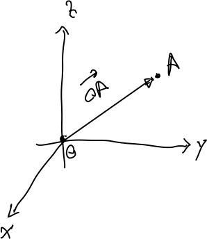

---
redirect_from:
  - "/vectors/section3-special-vectors"
interact_link: content/Vectors/section3_special_vectors.ipynb
kernel_name: python3
has_widgets: false
title: 'Some special vectors'
prev_page:
  url: /Vectors/section2_magnitude.html
  title: 'The magnitude of a vector'
next_page:
  url: /Vectors/section4_adding_vectors.html
  title: 'Adding vectors'
comment: "***PROGRAMMATICALLY GENERATED, DO NOT EDIT. SEE ORIGINAL FILES IN /content***"
---

## The zero vector
---

The __zero vector__ is the vector with the components 

$$\nonumber\left(\begin{array}{r} 0\\0\\0 \end{array}\right)$$

Moving from head to tail along the zero-vector means moving not at all, as the tail and head occupy the same location. Clearly, the magnitude of the zero vector is $0$.

## The unit vector
---

A __unit vector__ is a vector of magnitude $1$. 

## The opposite vector
---

Consider a vector 

$$\nonumber\vec{u}=\left(\begin{array}{r} x\\y\\z \end{array}\right)$$ 

The __opposite vector__ of $\vec{u}$, written $-\vec{u}$, has the components 

$$\nonumber -\vec{u}=\left(\begin{array}{r} -x\\-y\\-z \end{array}\right)$$ 

Clearly, the components of the opposite vector of $\vec u$ describe how to get from the head to the tail of the arrow represented by $\vec u$.

## The position vector of a point
---

Consider a point $A(A_x \vert A_y\vert A_z)$. The __position vector__ of point $A$ represents the arrow from the origin $O$ to point $A$. Thus we can denote this vector by $\overrightarrow{OA}$. 

Clearly, the components of the position vector are just the cooridnates of $A$:

$$\nonumber\overrightarrow{OA}=\left(\begin{array}{r} A_x\\A_y\\A_z \end{array}\right)$$

## Exercise
---

1. Determine the opposite vector of $\vec{v}=\left(\begin{array}{r} -2\\\ 2\\\ -3 \end{array}\right)$.
		
2. Determine the magnitude of the zero vector. How many other vectors of magnitude $0$ do exist?

3. Determine a unit vector with at least $2$ non-zero components. How many unit vectors exist? If you attach the arrow of all these vectors to the origin, what geometrical object is formed by the arrow heads?

4. Consider the points $A(0 \vert 5 \vert 3)$ and $B(0 \vert 2 \vert 5)$. Reflect $B$ about $A$. What are the coordinates of the reflected point $B$ ? Hint: draw a figure.

5. Consider the points $A(2 \vert 5 \vert 3)$ and $B(-4 \vert 2 \vert 10)$. Reflect $B$ about $A$. What are the coordinates of the reflected point $B$ ?

6. Which of these arrows in the yz-plane are described by the opposite vector of $\vec{a}$ Also, determine the components of $\vec{a}$ and $-\vec{a}$. 

## Solutions
---

