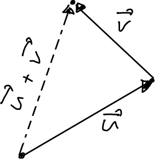
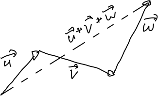
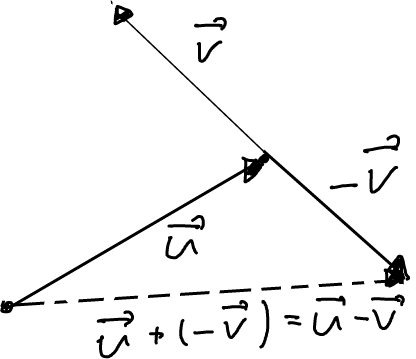
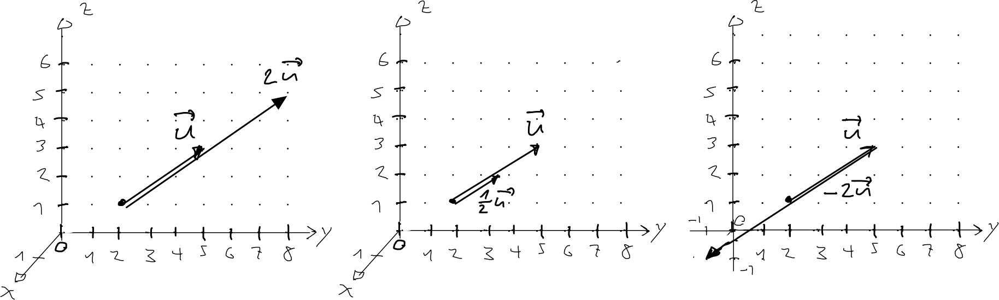
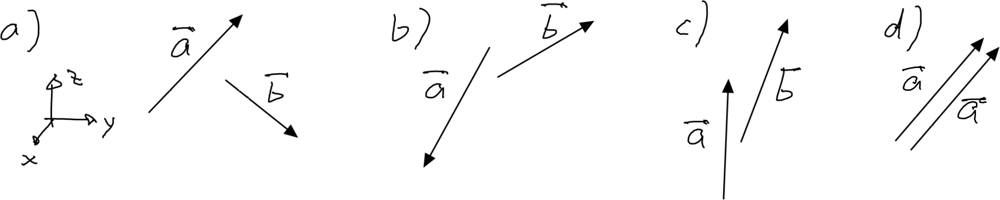
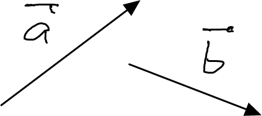
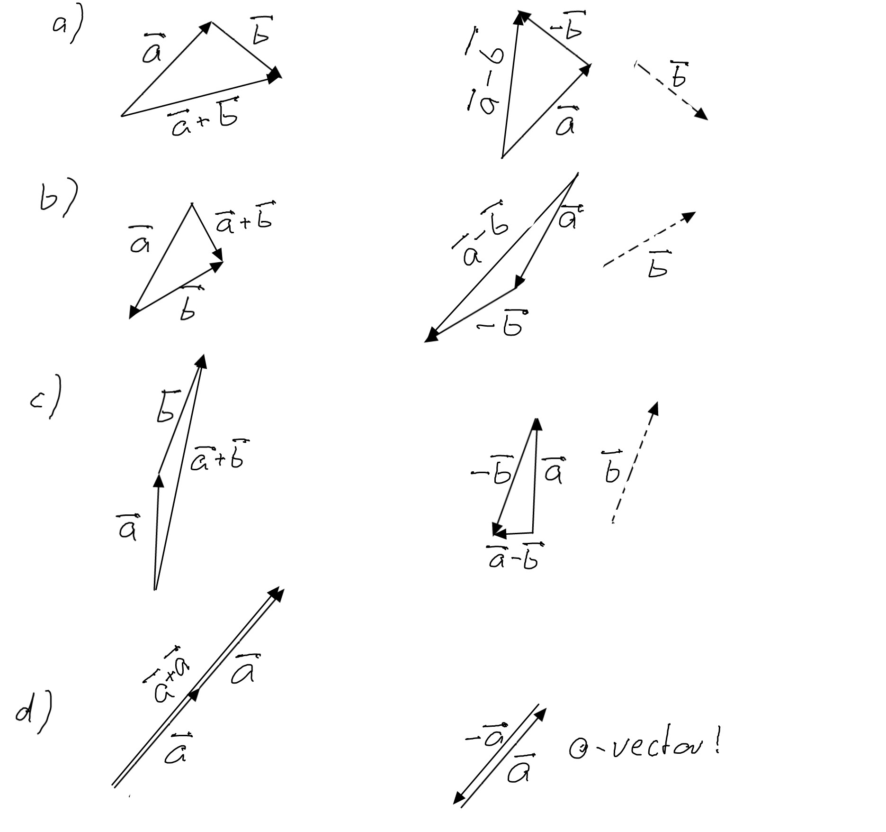
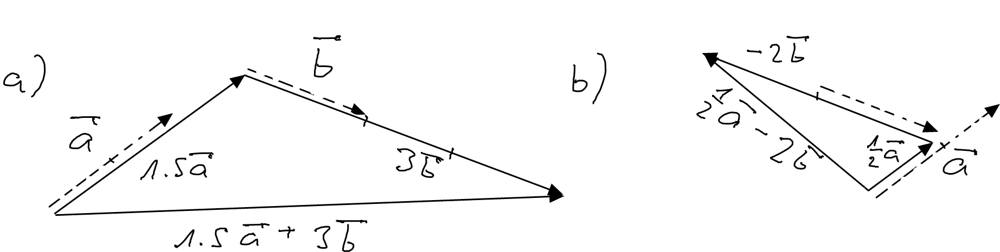
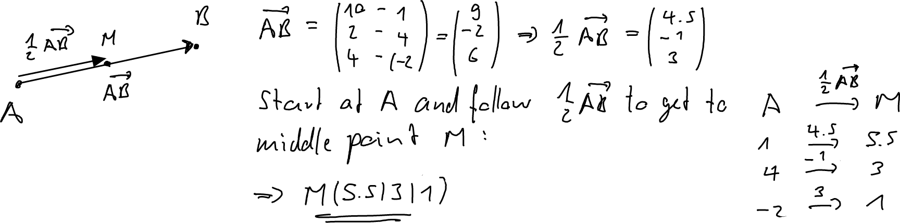

---
redirect_from:
  - "/vectors/section4-basic-operations"
interact_link: content/Vectors/section4_basic_operations.ipynb
kernel_name: python3
has_widgets: false
title: 'Basic vector operations'
prev_page:
  url: /Vectors/section3_special_vectors.html
  title: 'Some special vectors'
next_page:
  url: 
  title: ''
comment: "***PROGRAMMATICALLY GENERATED, DO NOT EDIT. SEE ORIGINAL FILES IN /content***"
---

## Adding a point and a vector
---

Consider a point $A(A_x \vert A_y \vert A_z)$ and a vector $\vec v =\left(\begin{array}{r} v_x\\\ v_y\\\ v_z \end{array}\right)$.

If we start at point $A$ and follow the instructions given by vector $\vec v$

$$\nonumber
\begin{array}{lcl}
A & \rightarrow & B \\
\hline
A_x & \overset{+v_x}{\rightarrow} & A_x+v_x \\ 
A_y & \overset{+v_y}{\rightarrow} & A_y+v_y \\ 
A_z & \overset{+v_z}{\rightarrow} & A_z+v_z \\ 
\end{array}
$$

we end up at new point with the coordinates 

$$\nonumber (A_x+v_x \vert A_y+v_y \vert A_z + v_z) $$

We denote this new point by 

$$\nonumber\boxed{A+\vec v}$$

or, if give it a new name, e.g. $B$, we write

$$\nonumber B = A+\vec v$$

## Adding two vectors
---

Consider two vectors $\vec v = \left(\begin{array}{r} v_x\\\ v_y\\\ v_z \end{array}\right)$ and $\vec w = \left(\begin{array}{r} w_x\\\ w_y\\\ w_z \end{array}\right)$. The __sum__ of the two vectors, denoted by 

$$\nonumber \boxed{\vec v+\vec w}$$

is a new vector with the components

$$\vec v+\vec w = \nonumber\left(\begin{array}{r} v_x+w_x\\\ v_y+w_y\\\ v_z+w_z \end{array}\right)$$

What is the relationship between the arrows represented by $\vec v$, $\vec w$, and $\vec v+\vec w$? We can actually construct the arrow of $\vec v+\vec w$ with the help of the arrows of $\vec v$ and $\vec w$ as follows: 
 - arrange the arrows of $\vec v$ and $\vec w$ such that the tail of $\vec w$ is attached to the head of $\vec v$
 - the arrow of $\vec v+\vec w$ is obtained by drawing an arrow from the tail of $\vec v$ to the head of $\vec w$

This construction is called *completing the triangle*.

Note: To find the arrow that is represented by the sum of three vectors $\vec u+\vec v+\vec w$, we form a chain of of the arrows (attach tail of $\vec v$ to head of $\vec u$, and tail of $\vec w$ to head of $\vec v$ and form the arrow from the tail of $\vec u$ to the head of  

## Subtracting two vectors
---

The __subtraction__ of $\vec w$ from $\vec v$ is defined as adding to $\vec v$ the opposite vector of $\vec w$: 

$$\nonumber \boxed{\vec v-\vec w = \vec v+ (-\vec w)}$$

The components are therefore 

$$\nonumber \vec v  - \vec w = \left(\begin{array}{r} v_x-w_x\\\ v_y-w_y\\\ v_z-w_z \end{array}\right)$$

It also follows that we can construct the arrow representing the vector $\vec v-\vec w$ by simply completing the triangle of the vector $\vec v$ and $-\vec w$. Recall that the arrow of $-\vec w$  is obtained by reflected the arrow of $\vec w$ about its tail.

## Multiplication of a vector with a scalar
---

Consider a vector $\vec v = \left(\begin{array}{r} v_x\\\ v_y\\\ v_z \end{array}\right)$ and a constant $c$, where $c$ can by any real number. In the context of vectors, a number is called a __scalar__. The __multiplication__ of $c$ with $\vec v$, denoted by 

$$\nonumber\boxed{c\cdot \vec{v}}$$

is defined as the vector with the components

$$\nonumber\vec v = \left(\begin{array}{r} c\cdot v_x\\\ c \cdot v_y\\\ c \cdot v_z \end{array}\right)$$

Thus each component of $\vec v$ is multiplied by the constant $c$. Make sure yu understand that 
- The arrow that is represented by $c \cdot \vec{v}$ is $c$ times longer than $\vec v$. 
- If $c$ is positive, the arrows point in the same direction, if $c$ is negative, the arrow points in the opposite direction (see figure below).
- For $c=2$ the arrow length is doubled, for $c=0.5$ the arrow length is halved. 
- More generally, for a $c>1$ the arrow length increases, for $0<c<1$ the arrow length decreases.

## Exercise q
---

1. Consider the vector $\vec{u}=\left(\begin{array}{r} -2\\\ 2\\\ -1 \end{array}\right)$  Determine the vector $\vec{v} = 3\cdot \vec{u}$ and verify that the magnitude of $\vec u$ is $3$ times bigger than the magnitude of $\vec{v}$.

2. Show that $0\cdot \vec{a}$ is the zero vector.

3. Show that $4\cdot (5\cdot \vec{a})=20\cdot \vec{a}$

4. Show the following:
   1. $\vec{a}+\vec{b}=\vec{b}+\vec{a}$
   2. $\vec{a}+(\vec{b}+\vec{c})=(\vec{a}+\vec{b})+\vec{c}$
   3. $\vec{b}-\vec{a}$ is the opposite vector of $\vec{a}-\vec{b}$
   4. $\vec{a}+\vec{a}=2  \vec{a}$
   5. $4 \vec{a} + 6   \vec{a} =10  \vec{a}$
   6. $4 \vec{a} - 6   \vec{a} =-2  \vec{a}$
   7. $3  (\vec{a} +\vec{b}) =3  \vec{a}+3  \vec{b}$

5. Construct arrows that represent the following vectors: $\vec{a}+\vec{b}$, $\vec{a}-\vec{b}$, where all the arrows are in the yz-plane.

        
6. Construct arrows that represent the following vectors: $1.5\vec{a}+3\vec{b}$, $0.5\vec{a}-2\vec{b}$, where all the arrows are in the yz-plane.
	

7. Find the point in the middle between the two points $A(1\vert 4\vert -2)$ and $B(10 \vert 2 \vert 4)$.

8. Consider the vectors $\vec{a}=\left(\begin{array}{r} 1\\\ -2\\\ 1 \end{array}\right)$ and $\vec{b}=\left(\begin{array}{r} 2\\\ 3\\\ -1 \end{array}\right)$. 
 1. Determine $\vert \vec a + \vec b \vert$ and show that this is *not* $\vert \vec a \vert + \vert \vec b \vert$.
 2. Indeed, use a figure to show that for any two vectors $\vec a$ and $\vec b$ it is always true that $\vert \vec a + \vec b \vert \leq \vert \vec a \vert + \vert \vec b \vert$. For what vectors is $\vert \vec a + \vec b \vert = \vert \vec a \vert + \vert \vec b \vert$?
 3. $\vert \vec a - \vec b \vert$ . Again, show that $\vert \vec a - \vec b \vert \neq \vert \vec a \vert - \vert \vec b \vert$.
 4. Determine the unit vector of $\vec a$ (that is, a vector of length one pointing in the same direction as $\vec a$).

## Solutions
---

1. $\vert\vec{u}\vert=\sqrt{(-2)^2+2^2+(-1)^2}=3$, 
$\vec v = 3\cdot \vec u = \left(\begin{array}{r} -6\\\ 6\\\ -3 \end{array}\right) \rightarrow \vert \vec{v}\vert =\sqrt{(-6)^2+6^2+(-3)^2}=9$. So indeed, three times bigger.

2. $0\cdot \vec{a}=\left(\begin{array}{r} 0\cdot a_x\\\ 0\cdot a_y\\\ 0\cdot a_z \end{array}\right) = \left(\begin{array}{r} 0\\\ 0\\\ 0 \end{array}\right)$

3. $4\cdot (5\cdot \vec{a})= 4\cdot \left(\begin{array}{r} 5\cdot a_x\\\ 5\cdot a_y\\\ 5\cdot a_z \end{array}\right) = \left(\begin{array}{r} 20\cdot a_x\\\ 20\cdot a_y\\\ 20\cdot a_z \end{array}\right)= 20\cdot \vec{a}$

4. So ...
   1. $\vec{a}+\vec{b}=\left(\begin{array}{r} a_x+b_x\\\ a_y+b_y\\\ a_z+b_z \end{array}\right) =\left(\begin{array}{r} b_x+a_x\\\ b_y+a_y\\\ b_z+a_z \end{array}\right) =\vec{b}+\vec{a}$
    
   2. $\vec{a}+(\vec{b}+\vec{c})=\vec{a}+\left(\begin{array}{r} b_x+c_x\\\ b_y+c_y\\\ b_z+c_z \end{array}\right) = \left(\begin{array}{r} a_x+b_x+c_x\\\ a_y+b_y+c_y\\\ a_z+b_z+c_z \end{array}\right)$ and similar, $(\vec{a}+\vec{b})+\vec{c}=\left(\begin{array}{r} a_x+b_x\\\ a_y+b_y\\\ a_z+b_z \end{array}\right)+\vec{c}=\left(\begin{array}{r} a_x+b_x+c_x\\\ a_y+b_y+c_y\\\ a_z+b_z+c_z \end{array}\right)$, so the same vectors.
    
   3. $\vec{b}-\vec{a}=\left(\begin{array}{r} b_x-a_x\\\ b_y-a_y\\\ b_z-a_z \end{array}\right)=\left(\begin{array}{r} -(a_x-b_x)\\\ -(a_y-b_y)\\\ -(a_z-b_z) \end{array}\right)=-(\vec{a}-\vec{b})$, and this is the opposite vector of $\vec{a}-\vec{b}$
	
   4. $\vec{a}+\vec{a}=\left(\begin{array}{r} a_x+a_x\\\ a_y+a_y\\\ a_z+a_z \end{array}\right)=\left(\begin{array}{r} 2 a_x \\\ 2 a_y\\\ 2 a_z \end{array}\right)=2  \vec{a}$
	
   5. $4 \vec{a} + 6   \vec{a} =\left(\begin{array}{r} 4a_x+6a_x\\\ 4a_y+6a_y\\\ 4a_z+6a_z \end{array}\right) = 10  \vec{a}$
	
   6. $4 \vec{a} - 6   \vec{a}  =\left(\begin{array}{r} 4a_x-6a_x\\\ 4a_y-6a_y\\\ 4a_z-6a_z \end{array}\right)  =-2  \vec{a}$
	
   7. $3  (\vec{a} +\vec{b}) = 3\left(\begin{array}{r} a_x+b_x\\\  a_y+b_y\\\  a_z+b_z \end{array}\right)= \left(\begin{array}{r} 3(a_x+b_x)\\\  3(a_y+b_y)\\\  3(a_z+b_z) \end{array}\right) = \left(\begin{array}{r} 3a_x+3b_x\\\  3a_y+3b_y\\\  3a_z+3b_z \end{array}\right) =3\vec{a}+3  \vec{b}$

5. 

6. 

7. 

8. 1. $\vec a + \vec b = \left(\begin{array}{r} 3\\\ 1\\\ 0 \end{array}\right) \rightarrow  \vert \vec a + \vec b \vert = \sqrt{3²+1²+0²}=\sqrt{10}$. But $\vert \vec a \vert + \vert \vec b \vert = \sqrt{6} +\sqrt{14} \neq \sqrt{10}$.

  2. Follows immediately from the completion of the triangle figure. The equation holds if the two vectors are parallel.
 
  3. $\vec a - \vec b = \left(\begin{array}{r} -1\\\ -5\\\ 2 \end{array}\right) \rightarrow  \vert \vec a + \vec b \vert = \sqrt{(-1)²+(-5)²+2²}=\sqrt{30}$. But $\vert \vec a \vert - \vert \vec b \vert = \sqrt{6} -\sqrt{14} \neq \sqrt{30}$
 
  4. As $\vert \vec a \vert =\sqrt{6}$, the length of arrow $\vec a$ is $\sqrt{6}$. As multiplying $\vec a$ the scalar $c=\frac{1}{\sqrt{6}}$ makes the arrow $c$ times "longer", the resulting length will be $1$. Thus, the unit vector is $\frac{1}{\sqrt{6}}\cdot \vec a = \left(\begin{array}{r} 1/\sqrt{6}\\\ -2/\sqrt{6}\\\ 1/\sqrt{6} \end{array}\right)$

