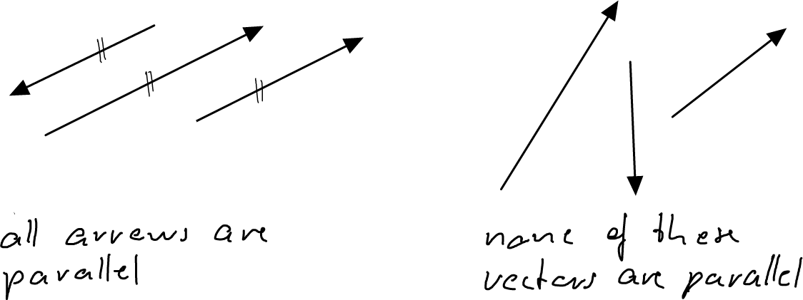

---
redirect_from:
  - "/vectors/section5-collinear-vectors"
interact_link: content/Vectors/section5_collinear_vectors.ipynb
kernel_name: python3
has_widgets: false
title: 'Collinear vectors'
prev_page:
  url: /Vectors/section4_basic_operations.html
  title: 'Basic vector operations'
next_page:
  url: /Vectors/section6_straightlines.html
  title: 'Straight lines'
comment: "***PROGRAMMATICALLY GENERATED, DO NOT EDIT. SEE ORIGINAL FILES IN /content***"
---

## Collinear vectors
---

Consider two vectors $\vec v$ and $\vec w$. We say that the vectors are __collinear__, written 

$$\nonumber\vec v \parallel \vec w$$ 

if there is a scalar $c$ such that 

$$\boxed{\nonumber \vec v = c \cdot \vec w}$$

(or if there is a scalar $d$ with $\vec w = d \cdot \vec v$). How do the arrows of collinear vectors look like? Well, as multiplying a vector with a scalar simply stretches the arrow by $c$, the arrows of collinear vectors are *parallel*. As $c$ can also be negative, the arrows can also point in opposite directions. 

How do we check if two vectors are collinear? We have to compare their components and check if there is a *single* scalar $c$ such that 

$$\nonumber
\begin{array}{lcl}
v_x & = & c\cdot w_x \\ 
v_y & = & c\cdot w_y \\ 
v_z & = & c\cdot w_z \\ 
\end{array}
$$

## Exercise
---

Are the following vectors collinear?

1. $\vec{u} = \left(\begin{array}{r} 1\\\ -1.5\\\ 5 \end{array}\right)$ and $\vec{v} = \left(\begin{array}{r} 2\\\ -3\\\ 9 \end{array}\right)$

2. $\vec{u} = \left(\begin{array}{r} 1\\\ -1.5\\\ 5 \end{array}\right)$ and $\vec{v} = \left(\begin{array}{r} 2\\\ -3\\\ 10 \end{array}\right)$

3. $\vec{u} = \left(\begin{array}{r} -4\\\ 2\\\ 3 \end{array}\right)$ and $\vec{v} = \left(\begin{array}{r} 6\\\ -3\\\ -4.5 \end{array}\right)$		

4. $\vec{u} = \left(\begin{array}{r} 8\\\ 0\\\ 4 \end{array}\right)$  and $\vec{v} = \left(\begin{array}{r} 4\\\ 0\\\ 2 \end{array}\right)$				

## Solutions
---

1. no
2. yes ($c=2$)
3. yes ($c=-1.5$)
4. yes ($c=1/2$)

