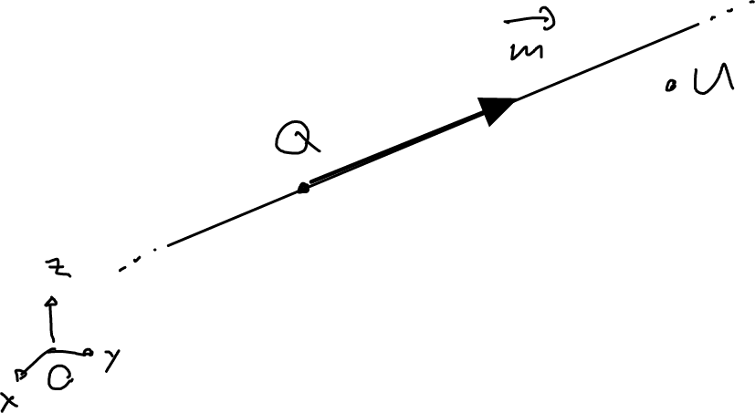
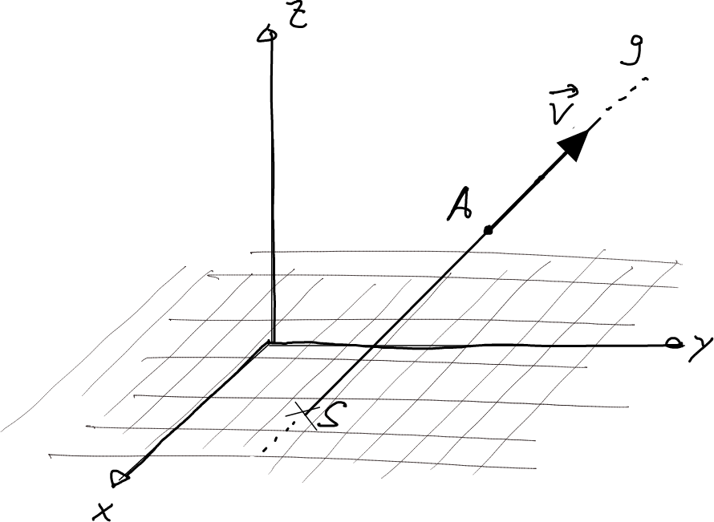

---
redirect_from:
  - "/vectors/section6-straightlines"
interact_link: content/Vectors/section6_straightlines.ipynb
kernel_name: python3
has_widgets: false
title: 'Straight lines'
prev_page:
  url: /Vectors/section5_collinear_vectors.html
  title: 'Collinear vectors'
next_page:
  url: /Vectors/section7_furtherProblems.html
  title: 'Further problems'
comment: "***PROGRAMMATICALLY GENERATED, DO NOT EDIT. SEE ORIGINAL FILES IN /content***"
---

## Straight lines
---

Consider a straight line $g$ that passes through some point $A$ and with direction $\vec v$. The vector $\vec v$ is called the __direction vector__ of $g$. Now, take another point $B$ in the 3d-space. How can we check if $B$ is on line $g$? 

As the figure above suggests, we have to check is if the vector from $A$ to $B$ is collinear to the direction vector $\vec v$:

$$\nonumber\boxed{B\in g\,\, \mbox{ if }\,\, \overrightarrow{AB} \parallel \vec v}$$

We can also rephrase this as follows: 

$$\nonumber\boxed{B\in g\,\, \mbox{ if there is a $c$ with}\,\, A+c\cdot \vec v = B}$$ 

that is, if we start at $A$ and walk along $c$ steps along the direction $\vec v$, we eventually have to arrive at $B$ if $B$ is on the line. 

Note that we regard a straight line as a set of infinitely many points, so the symbol $B\in g$ makes sense. Also, we can characterise the $g$ as

$$\nonumber g = \{ \mbox{all points $B$ in space with $\overrightarrow{AB} \parallel \vec v$} \}$$

## Exercise
---

1. A straight line $g$ passes through the points $U(1\vert 2\vert -1)$ and $V(5\vert 2\vert 10)$. Find a direction vector of $g$. How many direction vectors are there? Characterise them.

2. A line $h$ passes through the point $Q(1\vert 3\vert 2.2)$. Find its direction vector if $g$ is
   1. parallel to the $x$-axis.
   2. parallel to the $z$-axis.
   3. forms a right angle with the $xz$-plane.
   
4. Consider the straight line $h$ that passes through the point $Q(1\vert 2\vert -1)$ and has direction 

   $$\nonumber\vec{m}=\left(\begin{array}{r} 2\\ -1.5\\ 3 \end{array}\right)$$ 

   1. Is the point $U(9\vert -4\vert 11)$ on the line? 
   2. Does the line pass through the origin?
   
5. Consider the straight line $g$ that passes through the point $A(-2\vert 3\vert 4)$ and has direction 

   $$\vec{v}=\left(\begin{array}{r} 2\\ 1\\ -2 \end{array}\right)$$ 
   
   Where does $g$ intersect with the xy-plane? 

## Solutions
---

1. $\vec v = \overrightarrow{UB} = \left(\begin{array}{r} 4\\\ 0\\\ 11 \end{array}\right)$ 

2.  
    1. $\vec v = \left(\begin{array}{r} 1\\\ 0\\\ 0 \end{array}\right)$
    2. $\vec v = \left(\begin{array}{r} 0\\\ 0\\\ 1 \end{array}\right)$
    3. $\vec v = \left(\begin{array}{r} 0\\\ 1\\\ 0 \end{array}\right)$

3. So ... 
   1. Find out if $\vec{m} \parallel \overrightarrow{QU}$, that is, if there is a $c$ with $\overrightarrow{QU}=c\cdot \vec{m}$
   
      
   
       $$\nonumber\overrightarrow{QU}=\left(\begin{array}{r} 9-1\\\ -4-2\\\ 11-(-1) \end{array}\right) = \left(\begin{array}{r} 8\\\ -6\\\ 12 \end{array}\right) = 4\vec{m}$$
   
       so collinear. Thus, $U$ is on the line!
   
   2. We have to check if the origin $O$ is in $g$, that is, if $\vec{m} \parallel \overrightarrow{QO}$. This is not the case, so the line passes not through the origin. 
   
4. Denote the intersection point by $S$.
   
   
   We do not know the coordinates $S_x$ and $S_y$, but because $S$ is on xy-plane, we know that $S_z=0$, so we have $S(S_x\vert S_y\vert 0)$. We also know that $S$ is on line $g$, therefore $\vec{v} \parallel \overrightarrow{AS}$, and thus there is a stretching factor $c$ with $\overrightarrow{AS}=c\cdot \vec{v}$. With 
   
   $$\nonumber\overrightarrow{AS}=\left(\begin{array}{r} S_x+2\\ S_y-3\\ 0-4 \end{array}\right)$$ 
   
   it follows that there is a $c$ with 
   
   $$\nonumber\left(\begin{array}{r} S_x+2\\ S_y-3\\ 0-4 \end{array}\right) = \left(\begin{array}{r} 2c\\ c\\ -2c \end{array}\right) \begin{array}{l} \rightarrow S_x=2c-2 \\  \rightarrow S_y=c+3 \\ \rightarrow -4=-2c\end{array}$$ 
   
   and therefore $c=2$ (e.g. check out the third row). Thus, it is $S_x=2\cdot 2-2=2$, and $S_y=2+3=5$. The intersection point is $S(2\vert 5\vert 0)$.
   
   

