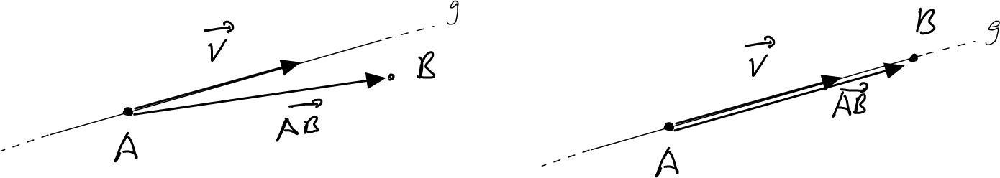

---
redirect_from:
  - "/vectors/section6-straightlines"
interact_link: content/Vectors/section6_straightlines.ipynb
kernel_name: python3
has_widgets: false
title: 'Straight lines'
prev_page:
  url: /Vectors/section5_collinear_vectors.html
  title: 'Collinear vectors'
next_page:
  url: 
  title: ''
comment: "***PROGRAMMATICALLY GENERATED, DO NOT EDIT. SEE ORIGINAL FILES IN /content***"
---

## Straight lines
---

Consider a straight line $g$ that passes through some point $A$ and with direction $\vec v$. The vector $\vec v$ is called the __direction vector__ of $g$. Now, take another point $B$ in the 3d-space. How can we check if $B$ is on line $g$? 

As the figure above suggests, we have to check is if the vector from $A$ to $B$ is collinear to the direction vector $\vec v$:

$$\nonumber\boxed{B\in g\,\, \mbox{ if }\,\, \overrightarrow{AB} \parallel \vec v}$$

Note that we regard a straight line as a set of infinitely many points, so the symbol $B\in g$ makes sense. Also, we can characterise the $g$ as

$$\nonumber g = \{ \mbox{all points $B$ in space with $AB \parallel \vec v$} \}$$

## Exercise
---

1. A straight line $g$ passes through the points $U(1\vert 2\vert -1)$ and $V(5\vert 2\vert 10)$. Find a direction vector of $g$. How many direction vectors are there? Characterise them.

2. A line $h$ passes through the point $Q(1\vert 3\vert 2.2)$. Find its direction vector if $g$ is
   1. parallel to the $x$-axis.
   2. parallel to the $z$-axis.
   3. forms a right angle with the $xy$-plane.
   
4. Consider the straight line $h$ that passes through the point $Q(1\vert 2\vert -1)$ and has direction 

   $$\nonumber\vec{m}=\left(\begin{array}{r} 2\\ -1.5\\ 3 \end{array}\right)$$ 

   1. Is the point $U(9\vert -4\vert 11)$ on the line? 
   2. Does the line pass through the origin?
   
5. Consider the straight line $g$ that passes through the point $A(-2\vert 3\vert 4)$ and has direction 

   $$\vec{v}=\left(\begin{array}{r} 2\\ 1\\ -2 \end{array}\right)$$ 
   
   Where does $g$ intersect with the xy-plane? 

