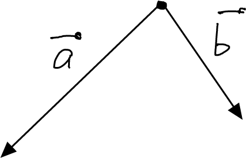
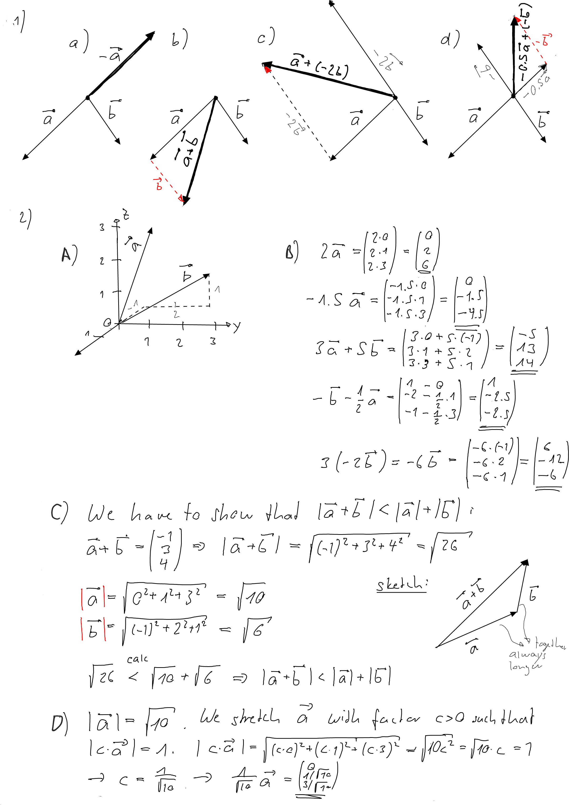
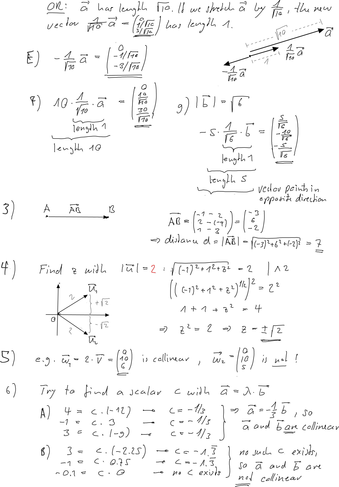
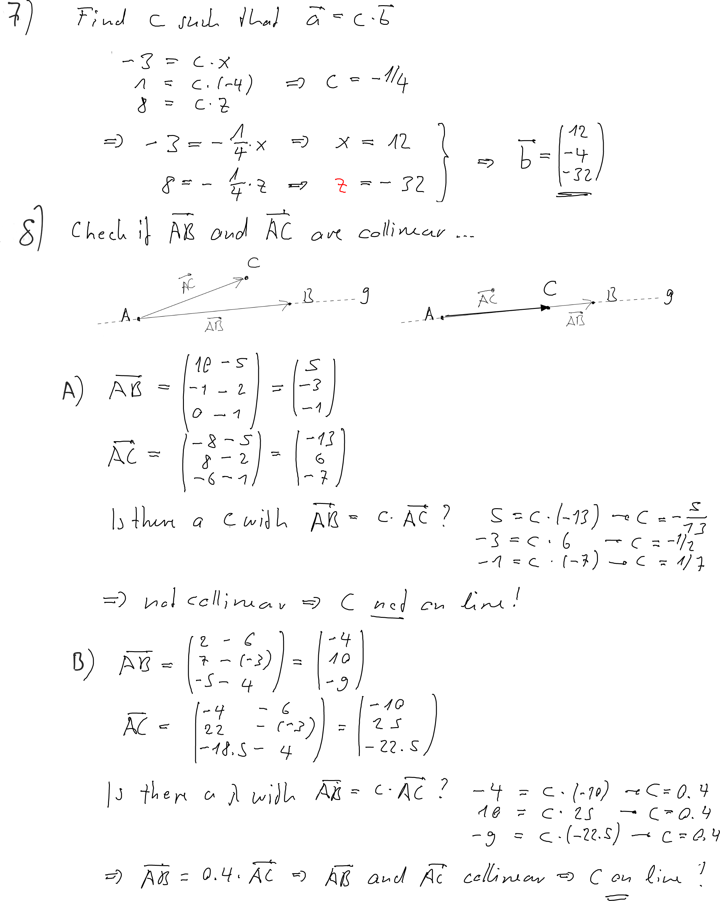
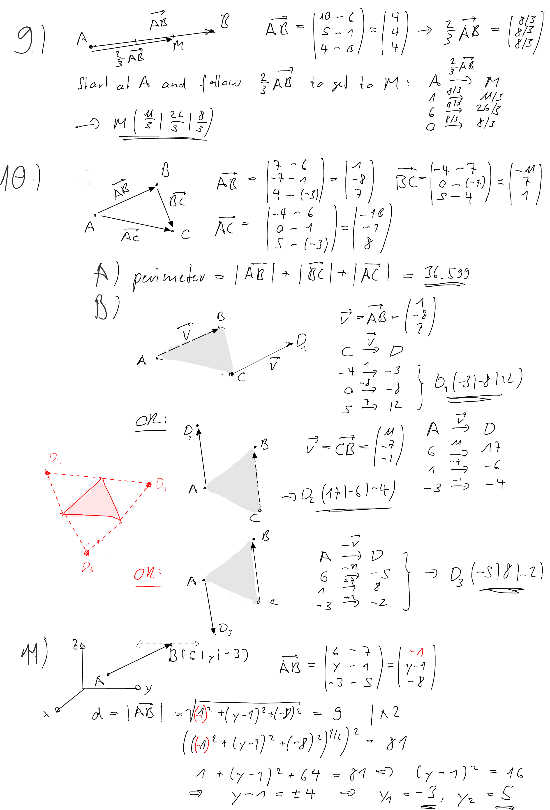
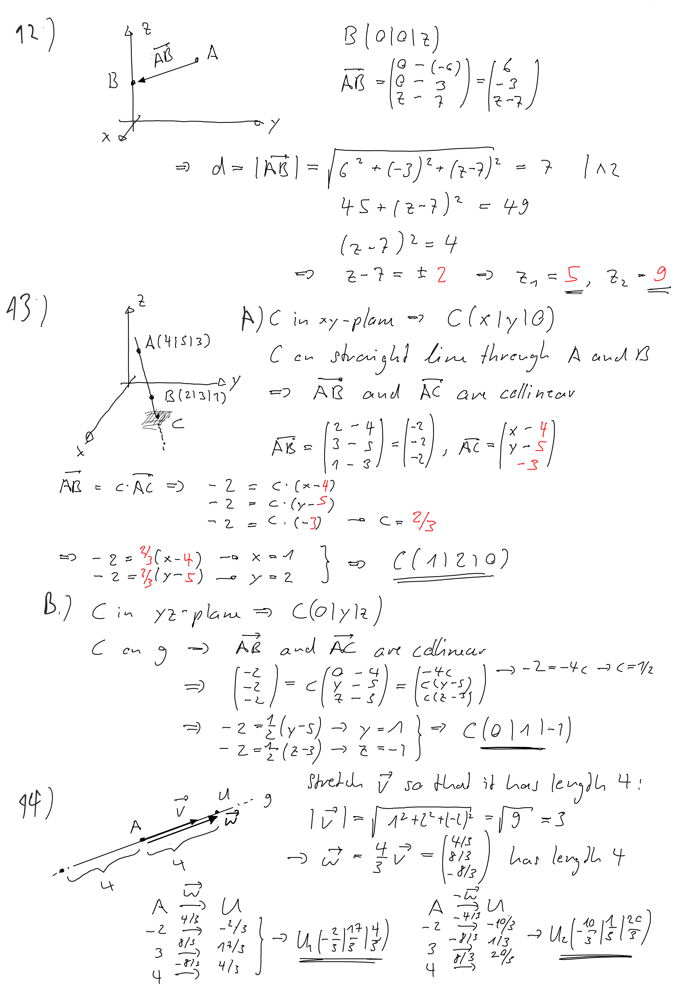
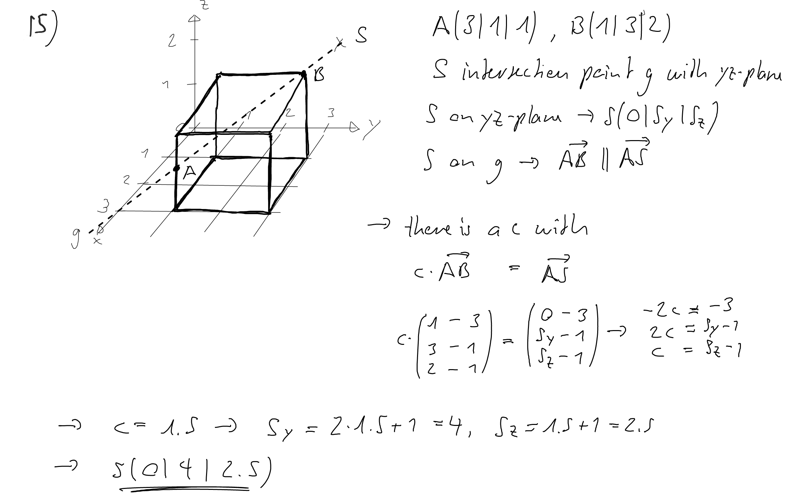

---
redirect_from:
  - "/vectors/section7-furtherproblems"
interact_link: content/Vectors/section7_furtherProblems.ipynb
kernel_name: python3
has_widgets: false
title: 'Further problems'
prev_page:
  url: /Vectors/section6_straightlines.html
  title: 'Straight lines'
next_page:
  url: 
  title: ''
comment: "***PROGRAMMATICALLY GENERATED, DO NOT EDIT. SEE ORIGINAL FILES IN /content***"
---

## Further problems
---

Let's start with some basic problems ...

1. Draw two vectors  $\vec{a}$ and $\vec{b}$ that are roughly similar to the ones shown in the figure below.

   

   Determine graphically the vectors $-\vec{a}$, $\vec{a}+\vec{b}$, $\vec{a}-2\vec{b}$, and $-0.5 \vec{a}-\vec{b}$
   
   2. dfdf
	
	\item Consider the two vectors $$\vec{a}=\vct{0}{1}{3} \mbox{\quad and \quad} \vec{b}=\vct{-1}{2}{1}$$
	\begin{enumerate}[label=\alph*)]
		\item Draw the arrow described by these vectors. Assume they start at the origin.
		\item Determine the components of the following vectors: \\$2\vec{a}$, $-1.5\vec{a}$, $3\vec{a}+5\vec{b}$, $-\vec{b}-\frac{1}{2}\vec{a}$,  $3(-2\vec{b})$
		\item Show by calculation that $$|\vec{a}+\vec{b}|\leq |\vec{a}|+|\vec{b}|$$ Use a sketch to argue that this is is always the case, for any vectors $\vec{a}$ and $\vec{b}$. This inequality is called the \Def{triangle inequality}.
		\item Determine the unit vector pointing in the same direction as $\vec{a}$.
		\item Determine the unit vector pointing in the opposite direction of $\vec{a}$.
		\item Find a vector of length 10 pointing in the same direction as $\vec{a}$.
		\item Determine a vector of length 5 pointing in opposite direction of $\vec{b}$.
	\end{enumerate}
	
	\item Determine the distance between the points $A(2|-4|3)$ and $B(-1|2|1)$.
	\item Consider the vector $\vec{u}=\vct{-1}{1}{z}$. Find all values $z$ such that $\vec{u}$ has magnitude $2$. 
	\item Consider the vector $\vec{u}=\vct{0}{5}{3}$. Find another vector that is collinear to $\vec{v}$, and yet another one that is not.
	\item Are the vectors $\vec{a}$ and $\vec{b}$ collinear?
	\begin{enumerate}[label=\alph*)]
		\item $\vec{a}=\vct{4}{-1}{3}$ and $\vec{b}=\vct{-12}{3}{-9}$
		\item $\vec{a}=\vct{3}{-1}{-0.1}$ and $\vec{b}=\vct{-2.25}{0.75}{0}$
	\end{enumerate}

	\item Find components $x$ and $z$ such that the vectors $\vec{a}=\vct{-3}{1}{8}$ and $\vec{b}=\vct{x}{-4}{z}$ are collinear.
\end{enumerate}
	

{\bfseries ... and now a bit more complicated.} 
\begin{enumerate}[label=B\arabic*.]
	\item Consider a straight line $g$ that passes through the points $A$ and $B$. Is the point $C$ on $g$?
	\begin{enumerate}[label=\alph*)]
		\item $A(5|2|1)$, $B(10|-1|0)$, $C(-8|8|-6)$
		\item $A(6|-3|4)$, $B(2|7|-5)$, $C(-4|22|-18.5)$
	\end{enumerate}

	\item Consider the points $A(6|1|0)$ and $B(10|5|4)$. Find the point $M$ on the segment between $A$ and $B$ such that it divides the segment with the ratio $2:1$.
	
	\item Consider a triangle $ABC$, where the vertices are $A(6|1|-3)$, $B(7|-7|4)$, and $C(-4|0|5)$. 
	\begin{enumerate}[label=\alph*)]
		\item Find the circumference of the triangle.
		\item Find a point $D$ such that the four points form a parallelogram. Is there more than one solution?
	\end{enumerate}

	\item Consider the point $A(7|1|5)$. A point $B$ with x-coordinate $6$ and z-coordinate $-3$ has to be moved in y-direction such that the distance between $A$ and $B$ is exactly $9$. Determine the y-coordinate of $B$.
	
	\item Find all the points on the z-axis such that the distance to the point $A(-6|3|7)$ is $7$.
	
	\item A straight line passes through the points $A(4|5|3)$ and $B(2|3|1)$. 
	\begin{enumerate}[label=\alph*)]
		\item  It intersects with the xy-plane at point $C$. Determine the coordinates of $C$. 
		\item It intersects with the yz-plane at point $C$. Determine the coordinates of $C$. 
	\end{enumerate}
	
	\item A straight line $g$ passes through the point $A(-2|3|4)$ and has direction $$vec{v}=\vct{1}{2}{-2}$$ Find all points $U$ that are on line $g$ and have distance $4$ from point $A$.
	
	\item Consider the cube shown below. 
	\begin{center}
		\includegraphics[scale=0.2]{pics/fp1_cube} 
	\end{center}
	Where does the straight line $g$ hit the yz-plane?
\end{enumerate}

## Solutions
---

