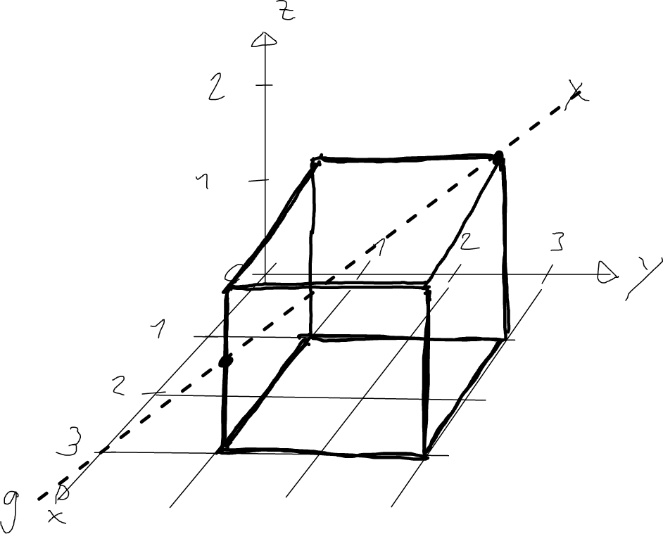

---
redirect_from:
  - "/vectors/section7-furtherproblems"
interact_link: content/Vectors/section7_furtherProblems.ipynb
kernel_name: python3
has_widgets: false
title: 'Further problems'
prev_page:
  url: /Vectors/section6_straightlines.html
  title: 'Straight lines'
next_page:
  url: /Vectors/section7_furtherProblems.html
  title: 'Further problems'
comment: "***PROGRAMMATICALLY GENERATED, DO NOT EDIT. SEE ORIGINAL FILES IN /content***"
---

## Further problems
---

1. Draw two vectors  $\vec{a}$ and $\vec{b}$ that are roughly similar to the ones shown in the figure below.

   

   Determine graphically the vectors $-\vec{a}$, $\vec{a}+\vec{b}$, $\vec{a}-2\vec{b}$, and $-0.5 \vec{a}-\vec{b}$
   
2. Consider the two vectors $\vec a= \left(\begin{array}{r} 0\\\ 1\\\ 3 \end{array}\right)$ and $\vec b = \left(\begin{array}{r} -1\\\ 2\\\ 1 \end{array}\right)$ 

   1. Draw the arrow described by these vectors. Assume they start at the origin.
   
   2. Determine the components of the following vectors:   $2\vec{a}$, $-1.5\vec{a}$, $3\vec{a}+5\vec{b}$, $-\vec{b}-\frac{1}{2}\vec{a}$,  $3(-2\vec{b})$
   
   3. Show by calculation that $\vert \vec{a}+\vec{b}\vert \leq \vert \vec{a}\vert + \vert\vec{b}\vert$.

   4. Determine the unit vector pointing in the same direction as $\vec{a}$.
   
   5. Determine the unit vector pointing in the opposite direction of $\vec{a}$.
   
   6. Find a vector of length 10 pointing in the same direction as $\vec{a}$.
   
   7. Determine a vector of length 5 pointing in opposite direction of $\vec{b}$.
	
3. Determine the distance between the points $A(2\vert -4\vert 3)$ and $B(-1\vert 2\vert 1)$.

4. item Consider the vector $\vec{u}=\left(\begin{array}{r} -1\\\ 1\\\ z \end{array}\right)$. Find all values $z$ such that $\vec{u}$ has magnitude $2$. 

5. Consider the vector $\vec{u}=\left(\begin{array}{r} 0\\\ 5\\\ 3 \end{array}\right)$. Find another vector that is collinear to $\vec{v}$, and another one that is not.
	
6. Are the vectors $\vec{a}$ and $\vec{b}$ collinear?
   1. $\vec{a}=\left(\begin{array}{r} 4\\\ -1\\\ 3 \end{array}\right)$ and $\vec{b}=\left(\begin{array}{r} -12\\\ 3\\\ -9 \end{array}\right)$
   2. $\vec{a}=\left(\begin{array}{r} 3\\\ -1\\\ -0.1 \end{array}\right)$ and $\vec{b}=\left(\begin{array}{r} -2.25\\\ 0.75\\\ 0 \end{array}\right)$

7. Find components $x$ and $z$ such that the vectors $\vec{a}=\left(\begin{array}{r} -3\\\ 1\\\ 8 \end{array}\right)$ and $\vec{b}=\left(\begin{array}{r} x\\\ -4\\\ z \end{array}\right)$ are collinear.

8. Consider a straight line $g$ that passes through the points $A$ and $B$. Is the point $C$ on $g$?
   1. $A(5\vert 2\vert 1)$, $B(10\vert -1\vert 0)$, $C(-8\vert 8\vert -6)$
   2. $A(6\vert -3\vert 4)$, $B(2\vert 7\vert -5)$, $C(-4\vert 22\vert -18.5)$

9. Consider the points $A(6\vert 1\vert 0)$ and $B(10\vert 5\vert 4)$. Find the point $M$ on the segment between $A$ and $B$ such that it divides the segment with the ratio $2:1$.
	
10. Consider a triangle $ABC$, where the vertices are $A(6\vert 1\vert -3)$, $B(7\vert -7\vert 4)$, and $C(-4\vert 0\vert 5)$. 

    1. Find the circumference of the triangle.
	
    2. Find a point $D$ such that the four points form a parallelogram. Is there more than one solution?

11. Consider the point $A(7\vert 1\vert 5)$. A point $B$ with x-coordinate $6$ and z-coordinate $-3$ has to be moved in y-direction such that the distance between $A$ and $B$ is exactly $9$. Determine the y-coordinate of $B$.
	
12. Find all the points on the z-axis such that the distance to the point $A(-6\vert 3\vert 7)$ is $7$.
	
13. A straight line passes through the points $A(4\vert 5\vert 3)$ and $B(2\vert 3\vert 1)$. 

    1. It intersects with the $xy$-plane at point $C$. Determine the coordinates of $C$. 

    2. It intersects with the yz-plane at point $C$. Determine the coordinates of $C$. 
	
14. A straight line $g$ passes through the point $A(-2\vert 3\vert 4)$ and has direction $vec{v}=\left(\begin{array}{r} 1\\\ 2\\\ -2 \end{array}\right)$ Find all points $U$ that are on line $g$ and have distance $4$ from point $A$.
	
15. Consider the cube shown below. 

    
    
	Where does the straight line $g$ hit the yz-plane?

## Solutions
---

