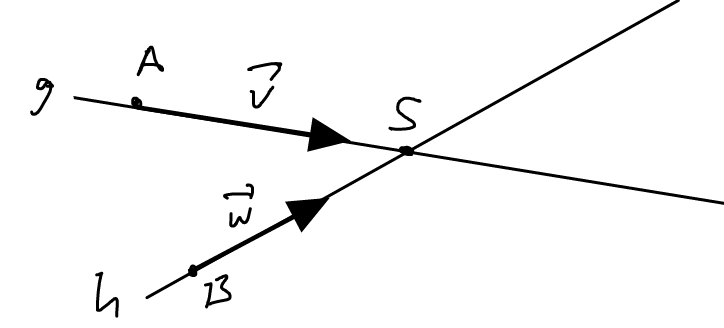
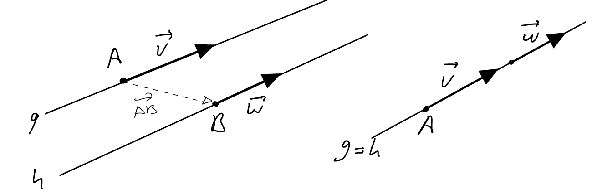
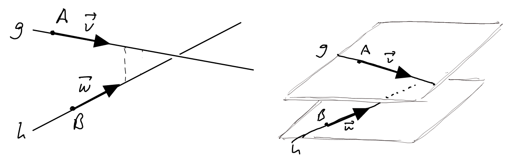

---
redirect_from:
  - "/vectors/section8-intersectionstraightlines"
interact_link: content/Vectors/section8_intersectionStraightLines.ipynb
kernel_name: python3
has_widgets: false
title: 'The intersection of straight lines'
prev_page:
  url: /Vectors/section7_furtherProblems.html
  title: 'Further problems'
next_page:
  url: /Vectors/section9_scalarproduct.html
  title: 'The intersection of straight lines'
comment: "***PROGRAMMATICALLY GENERATED, DO NOT EDIT. SEE ORIGINAL FILES IN /content***"
---

Consider two straight lines $g$ and $h$ in a three dimensional space. Assume that $g$ passes through point $A$ and has direction vector $\vec v$, and $h$ passes through point $B$ and has direction vector $\vec w$. The two lines can have the following position relative to each other:

## The straight lines  *intersect* at one point $S$:
---

Often we want to find the coordinates of $S$. To do so, note that we can characterise $S$ as this point in space which is on $g$ as well as on $h$. For no other point in the 3d-space is this true. Using vector language, this condition translates to the following two conditions for point $S$:
    
$$\nonumber\boxed{\overrightarrow{AS} \parallel \vec v \mbox{ and } \overrightarrow{BS} \parallel \vec w}$$ 
    
These two conditions hide a system of three equations from which the coordinates for $S$ can be found (see example below). Note that the two conditions above can also be rephrased as
    
$$\nonumber\boxed{\mbox{there is a scalar $c$ with } S=A+c\cdot \vec v \mbox{ and a scalar $d$ with } S=B+d\cdot \vec w}$$

### Example
---
Straight line $g$ passes through point $A(1 \vert 0 \vert 0)$ and has direction $\vec v=\left(\begin{array}{r} 2\\\ -1\\\ 1 \end{array}\right)$, straight line $h$ passes through point $B(13 \vert -5 \vert -5)$ and has direction $\vec w =\left(\begin{array}{r} -3 \\\ 1\\\ 4 \end{array}\right)$. They intersect at point $S(x\vert y\vert z)$. Let us find its coordinates:

$$\nonumber S\in g \rightarrow \overrightarrow{AS} \parallel \vec v \rightarrow \left(\begin{array}{r} x-1\\ y\\ z \end{array}\right) = c\cdot \left(\begin{array}{r} 2\\ -1\\ 1 \end{array}\right) \rightarrow \begin{array}{l} x=2c+1\\ y=-c\\ z=c \end{array}$$ 

$$\nonumber S\in h \rightarrow \overrightarrow{BS} \parallel \vec w \rightarrow \left(\begin{array}{r} x-13\\ y+5\\ z+5 \end{array}\right) = d\cdot \left(\begin{array}{r} -3\\ 1\\ 4 \end{array}\right) \rightarrow \begin{array}{l} x=-3d+13\\ y=d-5\\ z=4d-5 \end{array}$$ 

Thus we have a system of three equations with 2 unknowns:

$$\nonumber\begin{array}{rl} 2c+1 &=&-3d+13\\ -c&=&d-5\\ c&=&4d-5 \end{array}$$ 

Solving it, we get $c=3$ and $d=2$. Using $c=3$, we get $S(7\vert -3 \vert 3)$, using $d=2$ we also get $S(7\vert -3 \vert 3)$.

---

Note: Always calculate $S$ twice, once using the value for $c$ and once using the value for $d$. If there is an intersection point you will get twice the same coordinates for $S$. However, if the lines do not intersect, we could still make the same calculations above, but in this case the coordinates calculated using $c$ will differ from the coordinates calculated using $d$. This fact will be relevant for detecting skew lines (see below).

## The straight lines are *parallel*
---

They are parallel, if they either never intersect or if they form the same lines. 

From the figure it follows that $g$ and $h$ are parallel if
    
$$\nonumber\boxed{\vec v\parallel \vec w}$$ 

And they form the same line if, and only if
    
$$\nonumber\boxed{\overrightarrow{AB} \parallel \vec v \mbox{ or } \overrightarrow{AB} \parallel \vec w}$$ 
    

    
##  The straight lines are  *skew*
---

Two straight lines are said to be __skew__, if they neither intersect nor are they parallel. Obviously, skew lines are not possible in a 2d-space.

To find out if the two lines are skew or do intersect, first verify that they are not parallel. Then assume the lines intersect and calculate the point of intersection twice, using equations (1) and (2) above. If we get to different points $S$m we know that there is now intersection point, and the lines have to be skew.

### Example
---
Straight line $g$ passes through point $A(1 \vert 0 \vert 0)$ and has direction $\vec v=\left(\begin{array}{r} 2\\\ -1\\\ 1 \end{array}\right)$, straight line $h$ passes through point $B(3 \vert -5 \vert -5)$ and has direction $\vec w =\left(\begin{array}{r} -3 \\\ 1\\\ 4 \end{array}\right)$. Are they skew? 

- They are not parallel and not identical, because $\vec v \not \parallel \vec w$, so they might be skew.

- Is there an intersection point $S(x\vert y\vert z)$? Assume there is, and let us find its coordinates:
  
  $$\nonumber S\in g \rightarrow \overrightarrow{AS} \parallel \vec v \rightarrow \left(\begin{array}{r} x-1\\ y\\ z \end{array}\right) = c\cdot \left(\begin{array}{r} 2\\ -1\\ 1 \end{array}\right) \rightarrow \begin{array}{l} x=2c+1\\ y=-c\\ z=c \end{array}$$ 

  $$\nonumber S\in h \rightarrow \overrightarrow{BS} \parallel \vec w \rightarrow \left(\begin{array}{r} x-3\\ y+5\\ z+5 \end{array}\right) = d\cdot \left(\begin{array}{r} -3\\ 1\\ 4 \end{array}\right) \rightarrow \begin{array}{l} x=-3d+3\\ y=d-5\\ z=4d-5 \end{array}$$ 

  Thus we have a system of three equations with 2 unknowns:
  
  $$\nonumber\begin{array}{rl} 2c+1 &=&-3d+3\\ -c&=&d-5\\ c&=&4d-5 \end{array}$$ 

  Solving it, we get $c=3$ and $d=2$. Using $c=3$, we get $S(7\vert -3 \vert 3)$, using $d=2$ we get $S(-3\vert -3 \vert 3)$. So different points, so no intersection point exists. The lines are skew!

## Exercise
---
The straight line $g$ passes through $A$ and has direction $\vec{v}$, the straight line $h$ passes though the point $B$ and has direction $\vec{w}$. Determine the relative position of $g$ and $h$ (parallel, identical, skew, intersecting). If they intersect, determine the coordinates of the intersection point $S$.

1. $A(-2\vert 1 \vert 3)$, $B(1\vert 6\vert 2)$, $\vec{v}=\left(\begin{array}{r} -0.6\\\ -1\\\ 0.2 \end{array}\right)$, $\vec{w}=\left(\begin{array}{r} 3\\\ 5\\\ -1 \end{array}\right)$

2. $A(3\vert 2\vert -1)$, $B(2\vert 6\vert 1)$, $\vec{v}=\left(\begin{array}{r} 0.8\\\ 0.2\\\ -1 \end{array}\right)$, $\vec{w}=\left(\begin{array}{r} -4\\\ -1\\\ 5 \end{array}\right)$

3. $A(2\vert -1\vert 1)$, $B(-3\vert 5\vert 4)$, $\vec{v}=\left(\begin{array}{r} -1\\\ 2\\\ 1 \end{array}\right)$, $\vec{w}=\left(\begin{array}{r} 3\\\ -2\\\ 1 \end{array}\right)$

4. $A(0\vert 0\vert 1)$, $B(-2\vert -2\vert 5)$, $\vec{v}=\left(\begin{array}{r} 3\\\ 2\\\ 3 \end{array}\right)$, $\vec{w}=\left(\begin{array}{r} 4\\\ 3\\\ 1 \end{array}\right)$

5. Show that the three medians ("Seitenhalbierende") of the triangle with the vertices $A(0\vert 0\vert 0)$, $B(4\vert 0\vert 0)$, and $C(2\vert 3\vert 9)$ intersect at the same point $S$. Determine the coordinates of this point. This, by the way, is a general fact about triangles.

6. Assume that the $xy$-plane represents the ground, and the $z$-axis is the height. Aircraft 1 starts at airport $A(0km \vert 0km \vert 0km)$, moving along the direction $\left(\begin{array}{r} -5km\\\ 2.5km\\\ 0.1km \end{array}\right)$. Aircraft 2 starts at airport $B(200km \vert 300km \vert 3km)$, moving along the direction $\left(\begin{array}{r} 1.2km\\\ -0.2km\\\ 0.01km \end{array}\right)$. Is it theoretically possible for the two planes to collide? If so, and given that they take off at the same time, at what speed would the planes have to travel for a collision to happen after exactly two hours?   

## Solutions
---
1. parallel (overlapping)
2. parallel (not overlapping)
3. skew
4. intersecting with $S(6\vert 4\vert 7)$
5. the intersection point is $S(2\vert 1 \vert 3)$
6. The collision point is at $S(-400km\vert 200km\vert 8km)$. For a collision to happen, aircraft 1 needs to travel at speed of $223.6km/h$, aircraft 2 at a speed of $304.1km/h$. 

